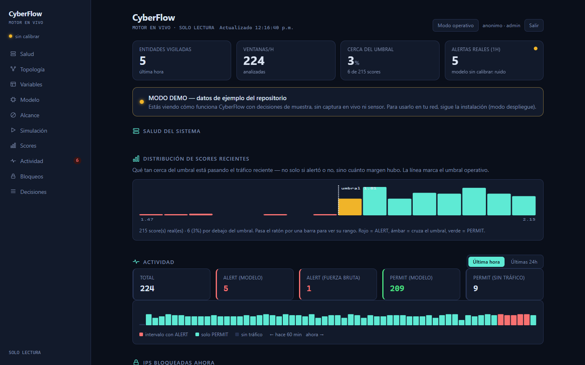
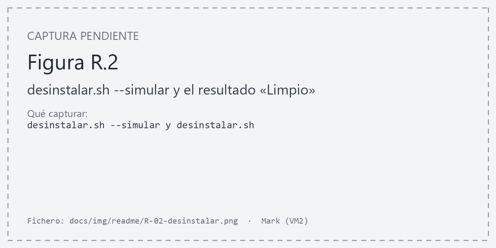

# Detección temprana de anomalías en redes, con respuesta graduada

Detecta tráfico anómalo con aprendizaje **no supervisado** y **responde de forma
graduada** —PERMIT, LIMIT o BLOCK— aplicando `nftables` en el host protegido a
través de un **feed firmado**, con caducidad escalonada y sin bloqueos infinitos.
No solo avisa: degrada o corta.

[](docs/dataset/DOI-ZENODO.md)
[](LICENSE)
[](.github/workflows/ci.yml)

```
Despliegue vigente (sensor por SPAN, enforcement distribuido):

Clientes ─┐                 copia SPAN      ┌───────────────────┐  feed firmado
          ├─► troncal ───────────────────► │ Sensor: Suricata + │─────────────┐
Atacante ─┘      │                          │ motor + publicador │             │
                 ▼                          └───────────────────┘   relay (bastión)
          Host protegido ◄── agente: nftables PERMIT/LIMIT/BLOCK ◄──────────────┘
```

> El sensor **observa una copia y no bloquea** el tráfico espejado: **decide** y
> publica; el **agente del host** aplica la acción. El esquema clásico
> «sensor → nftables, 120 s» es la **modalidad de laboratorio** evaluada en F6 (ver
> abajo).

---

## Qué hace

| | |
|---|---|
| **Extrae** | 31 variables de capas 2/3/4/7 por ventana e IP (extractor v3); el modelo usa **28** (contrato v2), **27 observables** |
| **Puntúa** | Isolation Forest **recalibrado en la red**, umbral `score_samples < −0,568892`, más cuatro heurísticos deterministas |
| **Responde** | PERMIT · LIMIT · BLOCK vía feed firmado y agente `nftables` en el host; caducidad 300 / 1800 / 3600 s, nunca ∞ |
| **Muestra** | Panel web de solo lectura con **TLS, login y roles** (modo demo aparte) |

Fuente de verdad del despliegue: [`docs/FICHA-TECNICA-DESPLIEGUE-VIGENTE.md`](docs/FICHA-TECNICA-DESPLIEGUE-VIGENTE.md).

### Dos modalidades — no mezclar sus cifras

| | **A — Laboratorio (histórica, F6)** | **B — Distribuida (vigente)** |
|---|---|---|
| Sensor | En línea; enruta y bloquea con `nftables` local | Por **SPAN**, sin IP; no bloquea el tráfico copiado |
| Modelo | OCSVM (`1,8126`), [model card histórica](docs/dataset/MODEL_CARD_OCSVM.md) | Isolation Forest recalibrado, [model card](docs/dataset/MODEL_CARD_IF_RECALIBRADO.md) |
| Respuesta | Bloqueo binario, 120 s | PERMIT / LIMIT / BLOCK con escalera de caducidad |
| Métricas | Mediana de bloqueo 8,0 s; cero caídas en 58 corridas | Se miden aparte (ver «Antes de confiar en él») |

Es **no supervisado**: aprende de tráfico normal, sin necesitar ejemplos
etiquetados de cada ataque. Por eso detecta comportamientos que no estaban en
el entrenamiento.

---

## Complementa, no reemplaza

CyberFlow **se enchufa en tu stack de seguridad; no lo suplanta.** Y la
arquitectura lo demuestra: **consume** Suricata (`eve.json`) y **emite** sus
alertas hacia el SIEM (Wazuh), sin duplicar lo que esas herramientas ya hacen.

| Capa | Herramienta | Rol |
|---|---|---|
| Firmas / amenazas conocidas | **Suricata** | CyberFlow lo **consume** (`eve.json`) |
| SIEM · logs · correlación · EDR | **Wazuh** | el **hub**: CyberFlow le **emite** sus veredictos |
| Anomalía **conductual de lo desconocido** + respuesta temprana | **CyberFlow** | el nicho: modelo *one-class* por entidad, **recalibrado a tu red**, con acción graduada |

Lo que **no** intenta ser (y por eso complementa): gestor de logs, EDR de host o
tablero-para-todo. Lo que **aporta**: detección no supervisada calibrada a la red
concreta, alimentando al SIEM — un equipo con Suricata + Wazuh lo **añade** sin
arrancar nada.

---

## Pruébalo en 2 minutos (modo demo)

Desde un clon recién hecho, **sin red ni sensor**:

```bash
bash scripts/demo.sh          # abre http://127.0.0.1:8788
```



*Figura R.1. Modo demo: el panel con decisiones de ejemplo, sin red ni sensor*

> Solo necesita **Python 3.11+** (librería estándar, **sin dependencias que
> instalar** ni salida a Internet). Verificado en Ubuntu 24.04 con Python 3.12.

Levanta el panel con **decisiones de ejemplo** (marcadas como demo) para ver el
flujo completo: detección, scores frente al umbral, topología y respuesta. Es la
**reproducibilidad** — mismo código + datos incluidos → se ve igual en cualquier
máquina. Para usarlo en **tu propia red** (replicabilidad), sigue la instalación
de más abajo.

---

## Requisitos

```
Demo y herramientas:  Python 3.11 o superior (solo librería estándar)
Modelo congelado:     las versiones EXACTAS de requirements-model.txt
                      (CPython 3.14.4; ver docs/INSTALACION.md, anexo B)
Sensor:               Linux · Suricata 7 u 8 · interfaz de captura sin IP
Host protegido:       nftables (lo gestiona el agente en una tabla propia)
```

El demo admite cualquier Python 3.11+; el modelo congelado no: con otras versiones de
scikit-learn el resultado cambia sin dar error (ver anexo B).

Para el laboratorio completo hace falta además un hipervisor. Sin él puede
usar el motor sobre una máquina que ya enrute tráfico.

---

## Puesta en marcha

Desde un clon recién hecho, cuatro comandos:

```bash
git clone https://github.com/marksato13/VF-Sistema-Open-Source-para-la-Deteccion-Temprana-de-Comportamientos-Anomalos-en-Redes-de-Datos.git cyberflow
cd cyberflow
bash scripts/setup/configurar.sh          # asistente: escribe tu configuración
```

El **asistente** auto-detecta la interfaz de captura (la que no tiene IP y recibe
el espejo) y su MAC, propone la **red a vigilar** desde tu subred, y pregunta el
**modo** (`observacion` o `bloqueo`), el **usuario** y la **raíz**. Escribe
`configs/cyberflow.local.toml` por ti; en una terminal pregunta con valores por
omisión, y sin terminal toma los detectados. (También puedes copiar y editar
`configs/cyberflow.toml` a mano si prefieres.)

```bash
sudo bash scripts/setup/instalar.sh --comprobar   # diagnostica, no toca nada
sudo bash scripts/setup/instalar.sh               # instala y arranca
```

`--comprobar` es un diagnóstico completo antes de tocar la máquina: requisitos,
validez de la configuración, si la interfaz de captura existe, si su MAC es la
esperada, si **está recibiendo tráfico de verdad**, si Suricata apunta a ella y
si `eve.json` crece. Si algo falla, dice qué y dónde mirar. El instalador se
niega a continuar mientras quede un fallo.

Después crea el entorno de Python, **comprueba que el modelo carga**, genera las
unidades de systemd desde su configuración, las arranca y verifica que el motor
está decidiendo.

> **Los artefactos publicados.** Antes de fiarse de una cifra:
> ```bash
> sha256sum -c docs/dataset/SHA256SUMS
> ```
> Desde la raíz del repositorio. **Si un solo hash no cuadra, pare.**

> **Elija el modo antes de instalar.** `bloqueo` (modalidad A) solo tiene sentido si
> esta máquina está **en el camino** del tráfico. Con un espejo SPAN observa pero no
> enruta: `nftables` ahí solo afecta a la propia máquina, y no daría ningún error. El
> instalador lo comprueba mirando `ip_forward`. Con SPAN (modalidad B) el sensor va en
> `observacion` y la respuesta la aplica el **agente del host**
> (`scripts/enforce/agente_enforce.py`) a partir del feed que firma
> `scripts/engine/publicar_feed.py`; diseño en
> [`DISENO-ENFORCEMENT.md`](https://github.com/marksato13/VF-PPI-TESIS-ORQUESTACION/blob/bb6e91d784622aab52f8b9f579186e50484dfdf6/01-arquitectura/DISENO-ENFORCEMENT.md).

Para redes sin salida a Internet, o si el espejo aún no llega al sensor, la
guía larga está en [`docs/INSTALACION.md`](docs/INSTALACION.md).

### Adaptar a tu red (replicabilidad)

Instalar no basta: el modelo publicado aprendió qué era «normal» en **otra** red.
Para que detecte bien en la tuya hay que **recalibrarlo con tu propio tráfico** —
ese es el paso que hace el sistema *replicable*, no solo reproducible.

> **El motor solo acepta el contrato v2 (28 variables).** La línea base se acumula con
> el extractor v3 (31 columnas: las 28 de v2 más 3 de capa 2), pero el modelo se
> **entrena con `multilayer-v2.json`**: el motor aborta si el esquema no coincide con
> su extractor. Y lo que guarda el entrenamiento es un **paquete** (modelo, escalador
> y umbral por separado), que el motor no puede cargar: hay que **promocionarlo**.

1. Deja el motor **capturando línea base** unas horas con tráfico real (no una red vacía).
2. **Particiona** por bloques con banda de guarda (sin fuga temporal):
   ```bash
   python3 scripts/dataset/particionar_linea_base.py \
     --entrada artifacts/linea-base/multilayer-v3.csv \
     --salida  artifacts/linea-base/particionado.csv \
     --informe artifacts/linea-base/particion.json
   ```
3. **Entrena con el contrato del motor y congela el umbral** desde validación (nunca
   desde prueba):
   ```bash
   python3 scripts/modeling/entrenar_preliminar.py \
     --entrada artifacts/linea-base/particionado.csv \
     --schema  configs/features/multilayer-v2.json \
     --salida  artifacts/preliminar/if-AAAA-MM.joblib \
     --informe artifacts/preliminar/if-AAAA-MM.json
   ```
   Comprueba en el informe que el **FPR sobre `test`** ronda `alpha` (0,05).
4. **Promociona el paquete a artefacto desplegable** —`Pipeline(escalador, Isolation
   Forest)` con `score_samples` sobre datos crudos, más su manifiesto—:
   ```bash
   python3 scripts/modeling/promover_preliminar.py \
     --paquete  artifacts/preliminar/if-AAAA-MM.joblib \
     --informe  artifacts/preliminar/if-AAAA-MM.json \
     --detector if_recalibrado_AAAA_MM \
     --salida-modelo     artifacts/preliminar/if_recalibrado_AAAA_MM_desplegable.joblib \
     --salida-manifiesto artifacts/preliminar/manifest-if-recalibrado-AAAA-MM.json
   ```
   Verifica en una sola pasada que el orden de variables del paquete coincide con el
   contrato y con el extractor del motor; convierte el umbral a `score_samples` (sin
   redondear) y comprueba que ninguna decisión cambia; registra los hashes del paquete,
   del informe y del artefacto; y termina con la verificación de equivalencia. Escribe en
   rutas nuevas y se niega a sobrescribir. (Opcional: `--deteccion-global`,
   `--deteccion-kali` y `--deteccion-fuente` para que el panel muestre la detección.)
5. **Verificación independiente** del par escrito (debe responder `EQUIVALENTE`):
   ```bash
   python3 scripts/modeling/verificar_equivalencia_umbral.py \
     --modelo artifacts/preliminar/if_recalibrado_AAAA_MM_desplegable.joblib \
     --manifiesto artifacts/preliminar/manifest-if-recalibrado-AAAA-MM.json \
     --detector if_recalibrado_AAAA_MM --umbral-decision <umbral_decision_function del informe>
   ```
6. **Despliega** apuntando la configuración local al artefacto nuevo —en
   `configs/cyberflow.local.toml`: `[rutas] modelo` y `manifiesto`, `[motor] detector`
   con el mismo nombre y `calibrado_en_esta_red = true`— y regenera las unidades, que
   pasan **el mismo detector al motor y al panel**:
   ```bash
   python3 scripts/setup/cyberflow_config.py --config configs/cyberflow.local.toml --mostrar  # revisar
   sudo .venv/bin/python scripts/setup/cyberflow_config.py --config configs/cyberflow.local.toml --escribir
   sudo systemctl daemon-reload && sudo systemctl restart ppi-motor ppi-dashboard
   ```
   Guarda antes una copia del `.toml` local: el rollback es restaurarla y repetir este
   paso. Hasta desplegar, el panel **avisa en ámbar** de que las alertas son ruido.

Detalle y advertencias en [`docs/INSTALACION.md`](docs/INSTALACION.md) §8.

### Desinstalar y reinstalar

```bash
sudo bash scripts/setup/desinstalar.sh --simular   # dice qué haría
sudo bash scripts/setup/desinstalar.sh             # quita CyberFlow
sudo bash scripts/setup/desinstalar.sh --todo      # y además Suricata
sudo bash scripts/setup/instalar.sh                # vuelve a dejarlo todo
```



*Figura R.2. `desinstalar.sh --simular` y el resultado «Limpio»*

Nunca toca la red, la sesión SPAN del switch, el hipervisor ni el usuario:
no los creó CyberFlow, y romperlos deja la máquina ciega o incomunicada.

Este ciclo **está probado**: el 2026-09-18 se desinstaló todo, Suricata
incluido, y el instalador lo reconstruyó desde cero hasta el motor decidiendo y
el panel respondiendo.

### Comprobar que sigue funcionando

```bash
bash scripts/setup/doctor.sh       # salud del sistema EN MARCHA; solo lee
tail -f logs/motor_decision.log
```

`doctor.sh` revisa servicios, captura, Suricata, motor, línea base, disco,
calibración y panel, y termina en «Todo sano», «Operativo, con N avisos» o
«N fallos». No confundirlo con `instalar.sh --comprobar`, que valida la máquina
**antes** de instalar.

Modalidad A (bloqueo en el sensor): `sudo nft list set inet ppi_enforce bloqueadas`.
Modalidad B, **en el host protegido**: `sudo nft list set inet cyberflow cyberflow_bloqueados`
y `sudo nft list set inet cyberflow cyberflow_limitados`.

---

## Uso diario

**Ver el panel.** En el despliegue vigente escucha en la red de gestión con **TLS y
login** (cuentas `admin` y `lector`, creadas con `scripts/setup/cyberflow_usuarios.py`),
y una regla `nftables` solo admite el origen autorizado (el bastión) como segunda capa:

```
https://<sensor>:8788        # p. ej. https://10.10.60.11:8788, desde el bastión
```

Si se configura `direccion = "127.0.0.1"`, escucha solo en local y se ve con un túnel
SSH. El modo demo (`scripts/demo.sh`) no tiene login y usa datos de ejemplo.

Muestra salud de los servicios, el umbral leído del manifiesto —no está escrito en el
código—, las IP con acción vigente y la actividad reciente. Es de **solo lectura** para
todo rol: no ejecuta ninguna acción. El rol `lector` no ve las secciones de desarrollador.

**Quitar una acción antes de tiempo:**

```bash
# modalidad B, en el host protegido:
sudo nft delete element inet cyberflow cyberflow_bloqueados { 10.10.20.30 }
# modalidad A, en el sensor:
sudo nft delete element inet ppi_enforce bloqueadas { 10.10.20.30 }
```

**Ver qué está decidiendo el motor:**

```bash
journalctl -u ppi-motor.service -f
```

---

## Adaptarlo a otra red

El modelo publicado en `artifacts/model/` es el **OCSVM de laboratorio**; el desplegado
en Sensor1 es un **Isolation Forest recalibrado con el tráfico de esa red**. En otra red
**el umbral casi seguro necesita recalibrarse**: lo que allí es normal aquí puede no
serlo. El camino es el de [«Adaptar a tu red»](#adaptar-a-tu-red-replicabilidad)
(pipeline v3). El protocolo de laboratorio que reproduce el modelo publicado es otro:

```bash
python scripts/features/extract_multilayer_v2.py --help
python scripts/modeling/calibrate_multilayer_v2_v1.py --help
```

Use solo datos de **validación** para fijar el umbral, nunca los de **prueba**.

---

## Antes de confiar en él

Limitaciones **medidas**, cada una con su modelo y su escenario (no intercambiarlas):

**El falso positivo depende del modelo, los datos y la configuración.**
- OCSVM de laboratorio: **4,71 %** en evaluación bloqueada y **25,81 % / 22,97 %** en la
  campaña F6 (modalidad A). Un `iperf` legítimo a 200 Mbit/s llegó a bloquear al cliente.
- OCSVM llevado **sin recalibrar** a la red de Sensor1: **92,4 %** de ALERT en los
  primeros minutos, sin ataques — en su mayoría las interfaces del cortafuegos emitiendo
  CARP.
- Isolation Forest recalibrado: **4,45 %** sobre **test normal retenido** (65 421
  ventanas). Es el FPR **del modelo**, no el del sistema completo con heurísticos y
  enforcement, que se mide aparte.
- **92,4 % → 4,45 % no es el efecto aislado de recalibrar:** entre ambas mediciones
  cambiaron el modelo, los datos y el alcance (se excluyó el plano de control y se
  deduplicó el espejo). Para atribuir la mejora habría que puntuar ambos modelos sobre el
  mismo conjunto retenido.

> El umbral publicado está calibrado para un laboratorio concreto. **En otra red hay que
> recalibrar antes de creerse una sola alerta.**

**La detección es por escenario, no global.** IF recalibrado sobre la Kali: 54/78
ventanas (69 %); HTTP 27/27, escaneo 27/43, DNS 0/8 (el ensayo apuntó a un host que no
era el resolver). La cobertura 9/9 por episodio es del **stack** (modelo + heurísticos);
el modelo solo, 6/9.

**Disponibilidad y tiempos son de F6.** «Cero caídas en 58 corridas (55 verificadas)» y
la mediana de bloqueo de 8,0 s se midieron en la modalidad A con el OCSVM; no demuestran
la disponibilidad ni los tiempos del despliegue distribuido, cuya acción depende de
timers con cadencia de un minuto.

**El motor usa un buffer incremental**, no reparsea todo el anillo de PCAP; los atrasos
bajo carga medidos en F6 (hasta 208 s) son de aquella versión y deben medirse de nuevo.

**Una de las 28 variables del modelo no es observable** (`tls_handshake_failure_ratio_60s`)
y queda constante; las otras 27 varían. La capa 2 del extractor v3 no entra al scoring.

---

## Documentación

**Para ponerlo en marcha y usarlo:**

| | |
|---|---|
| [`docs/INSTALACION.md`](docs/INSTALACION.md) | Guía de instalación de principio a fin, con las trampas reales |
| [`docs/GUIA-USUARIO.md`](docs/GUIA-USUARIO.md) | Uso diario, qué no ve, y resolución de problemas |
| [`docs/CONFIGURACION.md`](docs/CONFIGURACION.md) | Referencia de `cyberflow.toml`, opción por opción |
| [`docs/INVENTARIO.md`](docs/INVENTARIO.md) | Qué máquina, qué dirección, qué VLAN y en qué modo — y qué **no** debe estar |

**Para entender qué hay dentro:**

| | |
|---|---|
| [`docs/FICHA-TECNICA-DESPLIEGUE-VIGENTE.md`](docs/FICHA-TECNICA-DESPLIEGUE-VIGENTE.md) | **Fuente de verdad** del despliegue vigente |
| [`docs/RECONCILIACION-MANIFIESTO-MOTOR.md`](docs/RECONCILIACION-MANIFIESTO-MOTOR.md) | Qué declara cada artefacto frente a lo que corre |
| [`docs/dataset/MODEL_CARD_IF_RECALIBRADO.md`](docs/dataset/MODEL_CARD_IF_RECALIBRADO.md) | El modelo operativo (IF recalibrado), alcance y límites |
| [`docs/dataset/SYSTEM_CARD_MOTOR.md`](docs/dataset/SYSTEM_CARD_MOTOR.md) | El sistema: parte A (F6, histórica) y parte B (vigente) |
| [`docs/dataset/MODEL_CARD_OCSVM.md`](docs/dataset/MODEL_CARD_OCSVM.md) | El modelo de laboratorio (OCSVM) — **histórico** |
| [`docs/dataset/DATASHEET_MULTILAYER_V2.md`](docs/dataset/DATASHEET_MULTILAYER_V2.md) | Qué contiene el dataset y cómo se hizo |
| [`docs/dataset/DICCIONARIO_VARIABLES.md`](docs/dataset/DICCIONARIO_VARIABLES.md) | Las 28 variables del contrato, con fórmula y unidades |
| [`REPLICACION.md`](REPLICACION.md) | Qué se reproduce y qué no |
| [`CITATION.cff`](CITATION.cff) | Cómo citarlo |

---

## Licencias

**Código: MIT.** **Datos y documentación: ver [`LICENSE-DATA`](LICENSE-DATA).**

## Autores

Rubén Mark Salazar Tocas · Uziel Elias Sauñe Fernandez
Universidad Peruana Unión — E.P. de Ingeniería de Sistemas

Asesores: Ing. Nemias Saboya Ríos · Ing. Fernando Manuel Asin Gómez
