# Guía de instalación

Cómo poner CyberFlow a funcionar sobre una red real, de principio a fin.

Está escrita desde un despliegue real, no desde la teoría: cada tropiezo que
aparece aquí ocurrió de verdad y tiene su comprobación al lado.

---

## Antes de empezar: los dos modos

CyberFlow puede instalarse de dos formas, y **hay que elegir antes**, porque
cambian el cableado y lo que el sistema puede hacer.

| | **Observación (IDS)** | **Bloqueo (IPS)** |
|---|---|---|
| Dónde va el sensor | fuera del camino, recibe un espejo | **en el camino**, es el router |
| Qué hace | puntúa y registra | puntúa, registra **y corta** |
| `nftables` | no se toca | bloquea con expiración de 120 s |
| Riesgo | ninguno sobre la red | un falso positivo corta tráfico legítimo |
| `motor.modo` en la configuración | `"observacion"` | `"bloqueo"` |

> **Despliegue vigente: observación + enforcement distribuido.** En Sensor1 el sensor va
> en `observacion` (espejo SPAN) y la respuesta la aplica un **agente en el host
> protegido** (`scripts/enforce/agente_enforce.py`) a partir del feed firmado que publica
> `scripts/engine/publicar_feed.py`: PERMIT / LIMIT / BLOCK con caducidad 300 s (LIMIT) y
> 300/1800/3600 s (BLOCK). La expiración de 120 s de la tabla es **solo** del modo bloqueo
> local. Ver [`FICHA-TECNICA-DESPLIEGUE-VIGENTE.md`](FICHA-TECNICA-DESPLIEGUE-VIGENTE.md).

> **El error más caro es elegir «bloqueo» con un espejo.** Con un puerto SPAN el
> sensor **observa pero no está en el camino del tráfico**: las reglas de
> `nftables` en esa máquina solo afectan a lo que entra y sale de ella misma. El
> motor decidiría bien y no cortaría nada, sin dar ningún error.

Si su sensor recibe un espejo, el modo es `observacion`. Punto.

---

## 1 · Requisitos

```
Linux con systemd            Ubuntu 24.04 y Debian 13 probados
Python 3.12 o superior       ver la nota sobre versiones al final
Suricata 7 u 8
tcpdump
nftables                     solo en modo bloqueo
2 interfaces de red          una de gestión, una de captura
4 vCPU y 8 GiB               medido: suficiente hasta ~200 Mb/s
40 GB de disco               los PCAP y eve.json crecen rápido
```

**Dos interfaces, ni una más.** Es un error de diseño frecuente dar al sensor
una pata en cada VLAN «para verlas todas». No funciona y es peligroso:

- **No da visibilidad.** Una pata en una VLAN solo ve su propio tráfico más el
  difundido. El unicast entre dos equipos cualesquiera no llega nunca.
- **Convierte al sensor en un puente que se salta el cortafuegos.** Con patas
  simultáneas en varios segmentos, la máquina es un camino entre ellos.

La respuesta a «quiero ver la VLAN X» es el espejo, no otra interfaz.

---

## 2 · Preparar el punto de captura

### 2.1 En el switch

Un espejo local (SPAN) del enlace por el que pasa el tráfico que quiere
observar. En un Catalyst:

```
monitor session 1 source interface Gi1/0/23 both
monitor session 1 destination interface Gi2/0/19 encapsulation replicate
```

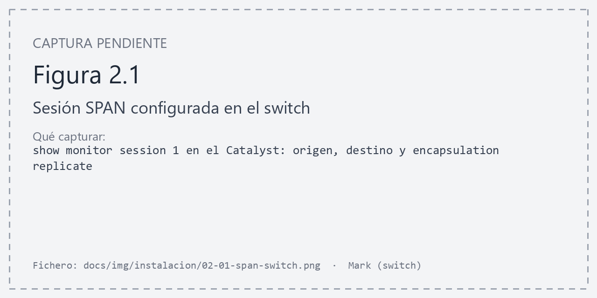

*Figura 2.1. Sesión SPAN configurada en el switch*

**`encapsulation replicate` no es opcional**: conserva la etiqueta 802.1Q
original, y sin ella se pierde la distribución por VLAN.

Elija como origen **el enlace del cortafuegos**, no un puerto de acceso: si el
enrutamiento entre VLAN vive en el borde, todo el tráfico entre segmentos cruza
por ahí.

**Vuelta atrás, tres comandos:**

```
no monitor session 1
interface GigabitEthernet2/0/19
 shutdown
```

> Un puerto destino de SPAN **deja de reenviar tráfico normal**. No use uno que
> esté en servicio.

### 2.2 Vigile la capacidad del espejo

Espejar **ambos sentidos** de un enlace de 100 Mb/s hacia un destino de 100 Mb/s
puede superar la capacidad en los picos, y **el switch descarta en silencio**.
No aparece como error: aparece como paquetes que no llegan, y sesga todas las
variables de tasa.

```
show interfaces GigabitEthernet2/0/19 counters errors
```

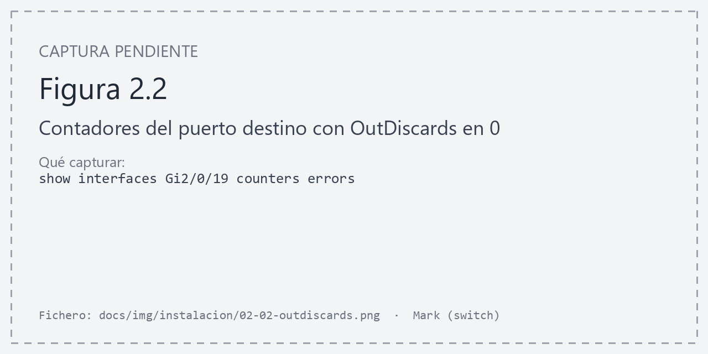

*Figura 2.2. Contadores del puerto destino con `OutDiscards` en 0*

**Si `OutDiscards` deja de ser 0, el dataset de esa sesión está contaminado.**
Compruébelo antes y después de cada captura y regístrelo: es evidencia.

### 2.3 Si el sensor es una máquina virtual

Este es el punto donde más gente se queda atascada. El switch envía, el sensor
no recibe, y no hay ningún error en ninguna parte.

En **VMware ESXi**, el grupo de puertos al que conecta la interfaz de captura
necesita los cuatro valores:

| Ajuste | Valor |
|---|---|
| Id. de VLAN | **4095** (todas las VLAN) |
| Modo promiscuo | **Aceptar** |
| Cambios de dirección MAC | **Aceptar** |
| Transmisiones falsificadas | **Aceptar** |

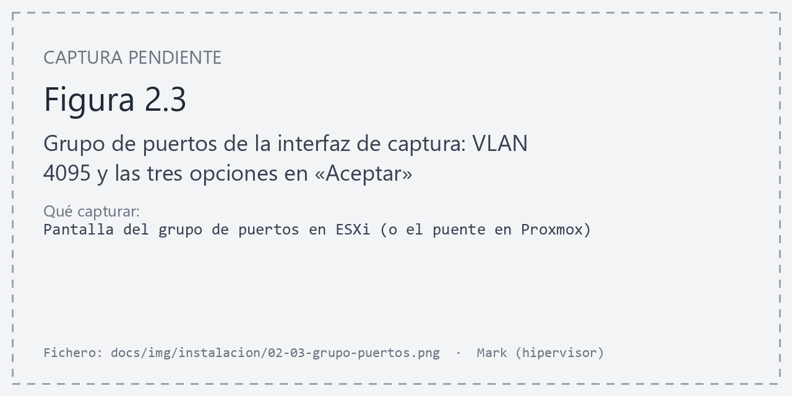

*Figura 2.3. Grupo de puertos de la interfaz de captura: VLAN 4095 y las tres opciones en «Aceptar»*

**Lo que manda es el ajuste del grupo de puertos, no el del vSwitch.** Ponerlo
en el vSwitch y no en el grupo de puertos es la causa más común del fallo.

Con `encapsulation replicate` las tramas llegan **etiquetadas**; un grupo de
puertos con una VLAN concreta descarta todo lo que venga de otra. De ahí el
4095.

En **Proxmox / KVM**, el equivalente es un puente sin filtrado de VLAN y la
interfaz en modo promiscuo.

---

## 3 · Preparar la interfaz de captura

```bash
ip -br link            # identifique la interfaz POR SU MAC, no por su nombre
```

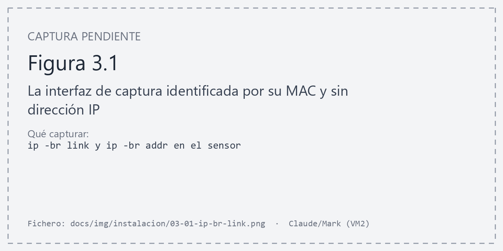

*Figura 3.1. La interfaz de captura identificada por su MAC y sin dirección IP*

> **Linux renumera las interfaces.** Al añadir o quitar un adaptador, lo que hoy
> es `ens37` puede no serlo mañana. Anote la MAC y compárela con la que muestra
> el hipervisor. Este proyecto ya perdió días por un desplazamiento de tarjetas.

La interfaz de captura **no debe tener dirección IP, ni IPv4 ni IPv6**, y no
debe pedir DHCP. Una sonda pasiva que emite no es pasiva.

```yaml
# /etc/netplan/50-cloud-init.yaml
    ens37:
      dhcp4: false
      dhcp6: false
      accept-ra: false
      link-local: []
      optional: true
```

```bash
sudo netplan generate && sudo netplan apply
```

> En Ubuntu, `cloud-init` puede regenerar ese fichero en cada arranque y
> deshacer el cambio. Si su instalación viene de `subiquity`, compruebe
> `/etc/cloud/cloud.cfg.d/90-installer-network.cfg` y desactive la gestión de
> red de cloud-init:
> ```bash
> echo 'network: {config: disabled}' | \
>   sudo tee /etc/cloud/cloud.cfg.d/99-disable-network-config.cfg
> ```

El resto —modo promiscuo, descargas de la NIC, IPv6— lo deja puesto la unidad
`cyberflow-capture-nic.service`, que se genera en el paso 6.

---

## 4 · Comprobar que llega el espejo

**No siga sin esto.** Instalar Suricata sobre una interfaz muda es perder el
tiempo.

```bash
sudo ip link set ens37 up promisc on
cat /sys/class/net/ens37/statistics/rx_packets; sleep 10
cat /sys/class/net/ens37/statistics/rx_packets
sudo tcpdump -i ens37 -e -nn -c 20
```

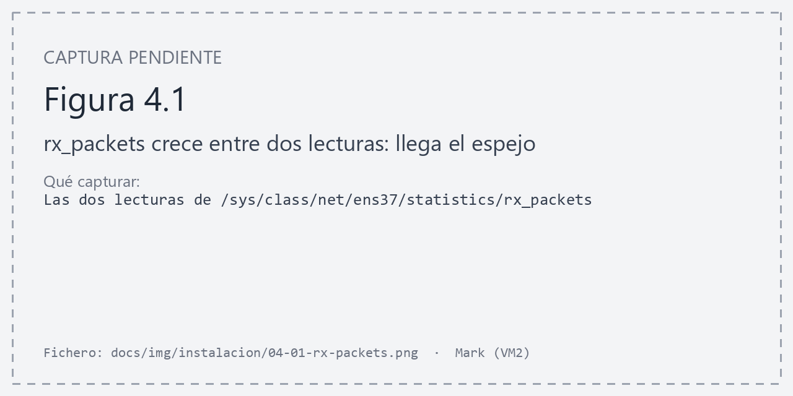

*Figura 4.1. `rx_packets` crece entre dos lecturas: llega el espejo*

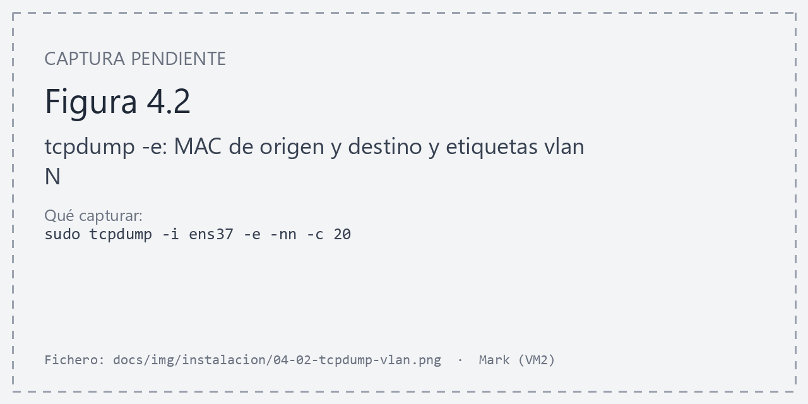

*Figura 4.2. `tcpdump -e`: MAC de origen y destino y etiquetas `vlan N`*

Tiene que cumplirse **todo**:

1. `rx_packets` **crece** de forma sostenida
2. `tcpdump -e` muestra **MAC de origen y destino**
3. aparecen **etiquetas `vlan N`** *(o queda registrado que no, y por qué)*
4. `OutDiscards` del puerto del switch **sigue en 0**

### Si `rx_packets` no crece

Por orden de probabilidad:

| Causa | Comprobación |
|---|---|
| Grupo de puertos sin VLAN 4095 | paso 2.3 |
| Grupo de puertos sin modo promiscuo | paso 2.3 |
| Interfaz del invitado sin promiscuo | `ip -d link show ens37 \| grep promisc` |
| La vNIC no está en ese grupo de puertos | mire la configuración de la VM |
| El switch no está espejando | `show monitor session all` |

> `promiscuity 0` mientras `tcpdump` **no** está corriendo es normal: `tcpdump`
> lo activa él mismo. No es síntoma de nada.

### Si aparecen tramas pero sin etiqueta `vlan N`

No es catastrófico. Las demás variables de capa 2 —MAC, ARP, EtherType, tamaño
de trama— siguen siendo viables; solo la distribución por VLAN se queda sin
fuente. Anótelo y siga.

---

## 5 · Suricata

```bash
sudo apt-get install -y suricata
sudo cp /etc/suricata/suricata.yaml /etc/suricata/suricata.yaml.orig
```

Tres cambios en `/etc/suricata/suricata.yaml`:

```yaml
vars:
  address-groups:
    HOME_NET: "[10.10.0.0/16]"      # sus redes reales

af-packet:
  - interface: ens37                # su interfaz de captura
    checksum-checks: no             # ver abajo
```

**`checksum-checks: no` importa.** En tráfico espejado las sumas de verificación
vienen calculadas por la NIC del emisor y llegan inválidas; validarlas
descartaría paquetes buenos.

```bash
sudo suricata -T -c /etc/suricata/suricata.yaml -v   # tiene que pasar limpio
sudo systemctl enable --now suricata
wc -l /var/log/suricata/eve.json; sleep 60; wc -l /var/log/suricata/eve.json
```

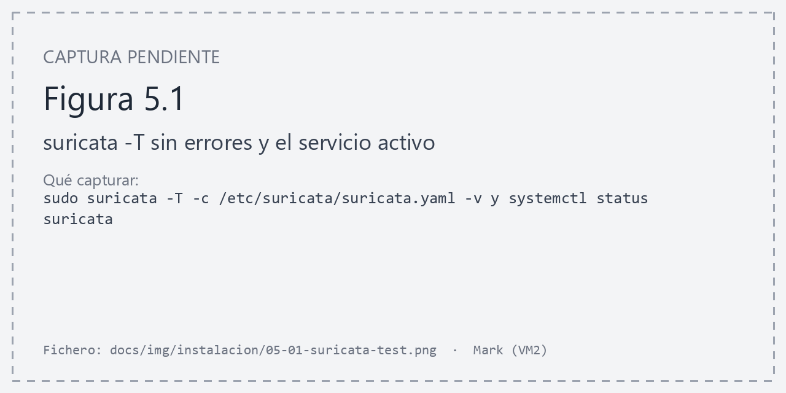

*Figura 5.1. `suricata -T` sin errores y el servicio activo*

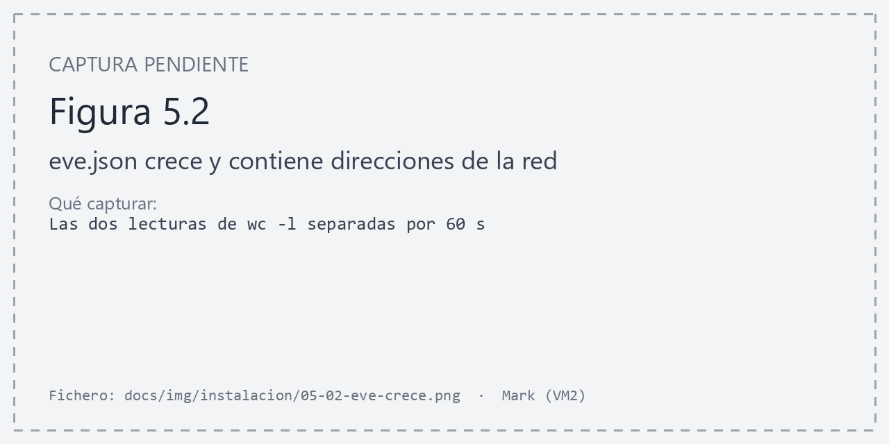

*Figura 5.2. `eve.json` crece y contiene direcciones de la red*

El fichero tiene que **crecer** y contener direcciones de su red.

> El paquete de Ubuntu trae `/etc/default/suricata` con `RUN=no`,
> `LISTENMODE=nfqueue` e `IFACE=eth0`. **La unidad de systemd no lo lee.**
> Es un fichero vestigial que induce a error; no lo toque.

### Ponga un tope a los registros

`eve.json` puede llenar la raíz en una ráfaga, y un `/` lleno tumba la máquina
entera, incluido el acceso por SSH. El `logrotate` del paquete **no trae ni
frecuencia ni límite de tamaño**:

```
# /etc/logrotate.d/suricata
        daily
        maxsize 500M
        rotate 7
```

---

## 6 · Instalar CyberFlow

> **La vía corta.** Si los pasos 1 a 5 están hechos, todo lo que sigue lo hacen
> tres comandos: el asistente escribe la configuración, el instalador se
> diagnostica solo y luego instala.
> ```bash
> bash scripts/setup/configurar.sh                 # escribe configs/cyberflow.local.toml
> sudo bash scripts/setup/instalar.sh --comprobar  # diagnostica, no toca nada
> sudo bash scripts/setup/instalar.sh              # instala y arranca
> bash scripts/setup/doctor.sh                     # salud, ya en marcha
> ```
> El resto de esta sección explica qué hace por dentro, por si prefiere ir a
> mano o algo falla.

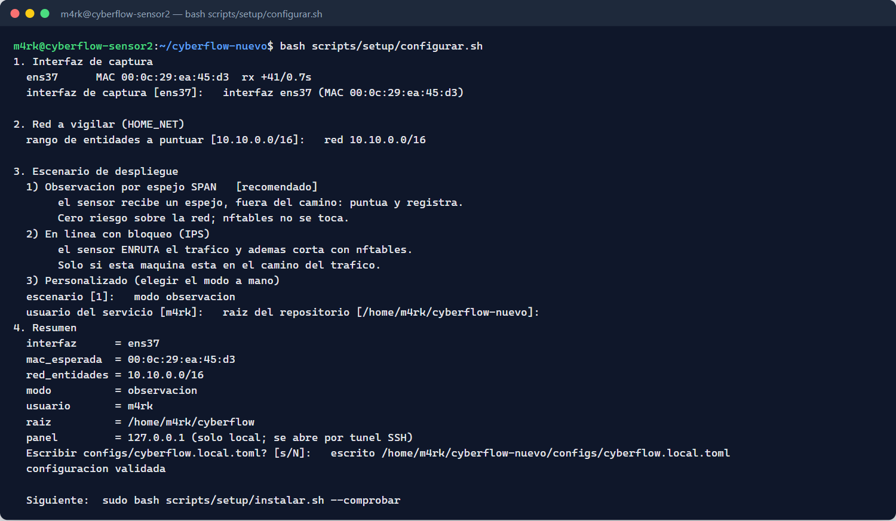

*Figura 6.1. Asistente `configurar.sh`: interfaz, MAC y red detectadas*

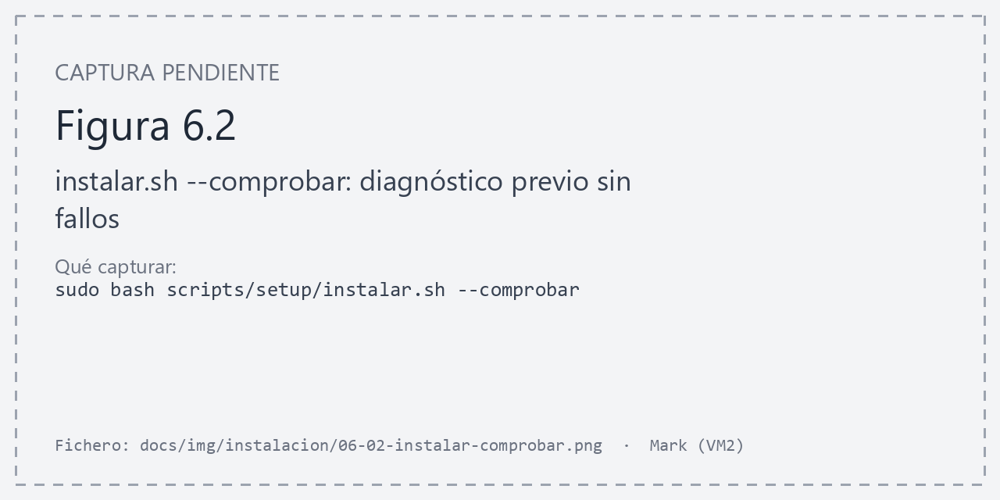

*Figura 6.2. `instalar.sh --comprobar`: diagnóstico previo sin fallos*

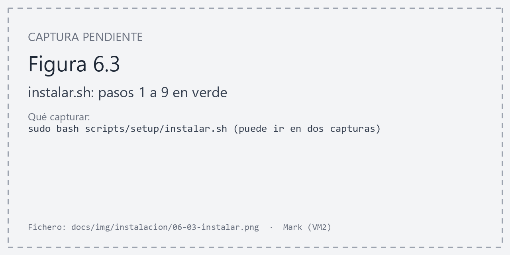

*Figura 6.3. `instalar.sh`: pasos 1 a 9 en verde*

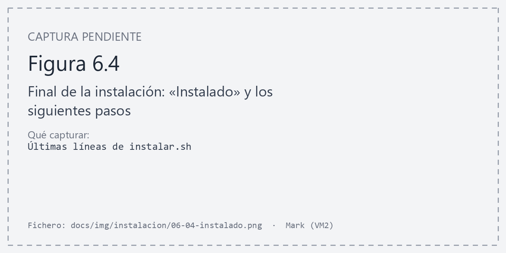

*Figura 6.4. Final de la instalación: «Instalado» y los siguientes pasos*


```bash
git clone <este-repositorio> cyberflow && cd cyberflow
python3 -m venv .venv
.venv/bin/python -m pip install -r requirements-model.txt
```

> Si `python3 -m venv` falla con *«No module named pip»*, instale
> `python3-venv`. En una máquina sin salida a Internet, vea el anexo A.

**Compruebe que los artefactos son los publicados:**

```bash
sha256sum -c docs/dataset/SHA256SUMS
```

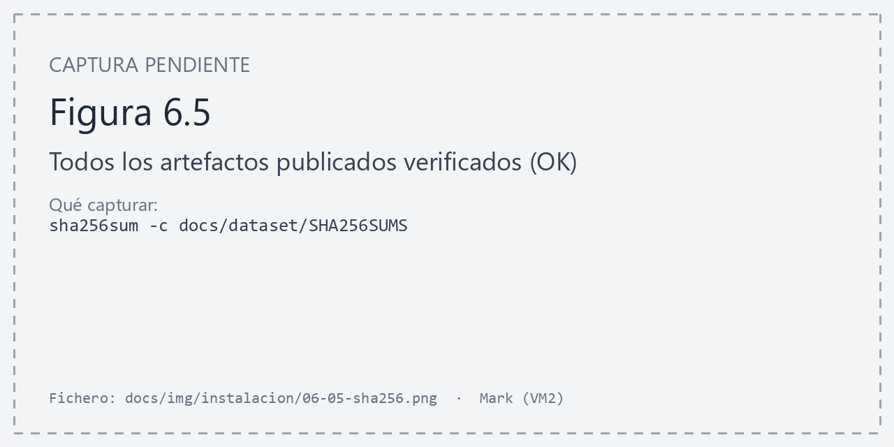

*Figura 6.5. Todos los artefactos publicados verificados (`OK`)*

Si un solo hash no cuadra, pare.

**Configure.** Todo lo que cambia entre instalaciones vive en un fichero:

```bash
cp configs/cyberflow.toml configs/cyberflow.local.toml
$EDITOR configs/cyberflow.local.toml
```

Lo mínimo: `captura.interfaz`, `red.red_entidades`, `rutas.usuario`,
`rutas.raiz` y `motor.modo`. Ver [CONFIGURACION.md](CONFIGURACION.md).

**Valide antes de escribir nada:**

```bash
python3 scripts/setup/cyberflow_config.py --config configs/cyberflow.local.toml --comprobar
python3 scripts/setup/cyberflow_config.py --config configs/cyberflow.local.toml --mostrar
```

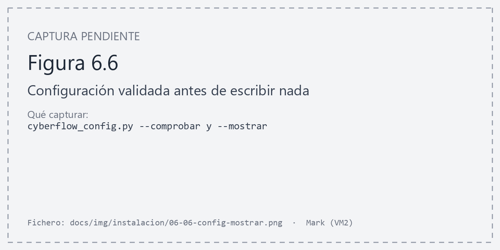

*Figura 6.6. Configuración validada antes de escribir nada*

**Genere e instale las unidades:**

```bash
sudo python3 scripts/setup/cyberflow_config.py --config configs/cyberflow.local.toml --escribir
sudo systemctl daemon-reload
sudo systemctl enable --now cyberflow-capture-nic ppi-motor-capture ppi-motor
```

Guarda una copia `.anterior` de cada unidad que sobrescribe.

### El panel: clave de sesión, certificado y cuentas

El instalador no crea las cuentas: las contraseñas se teclean, nunca van en un
fichero ni en un argumento. Cuatro comandos, una vez:

```bash
sudo python3 scripts/setup/cyberflow_usuarios.py --clave-sesion
sudo python3 scripts/setup/cyberflow_usuarios.py --certificado --nombre <IP-o-nombre-del-sensor>
sudo python3 scripts/setup/cyberflow_usuarios.py --crear admin  --rol admin
sudo python3 scripts/setup/cyberflow_usuarios.py --crear lector --rol lector
```

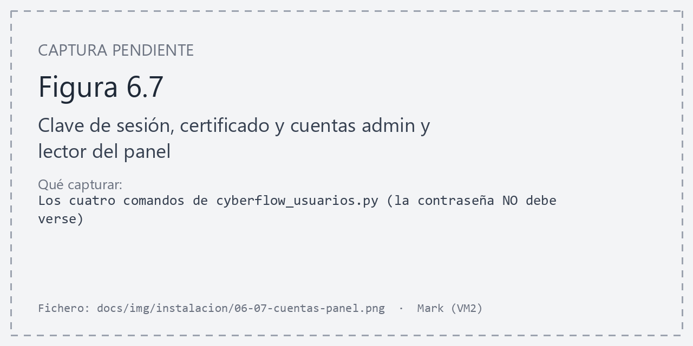

*Figura 6.7. Clave de sesión, certificado y cuentas `admin` y `lector` del panel*

`admin` ve también las secciones de desarrollador; `lector`, solo la operación.

---

## 7 · Comprobar que funciona

```bash
bash scripts/setup/doctor.sh                # todo de una vez; solo lee
```

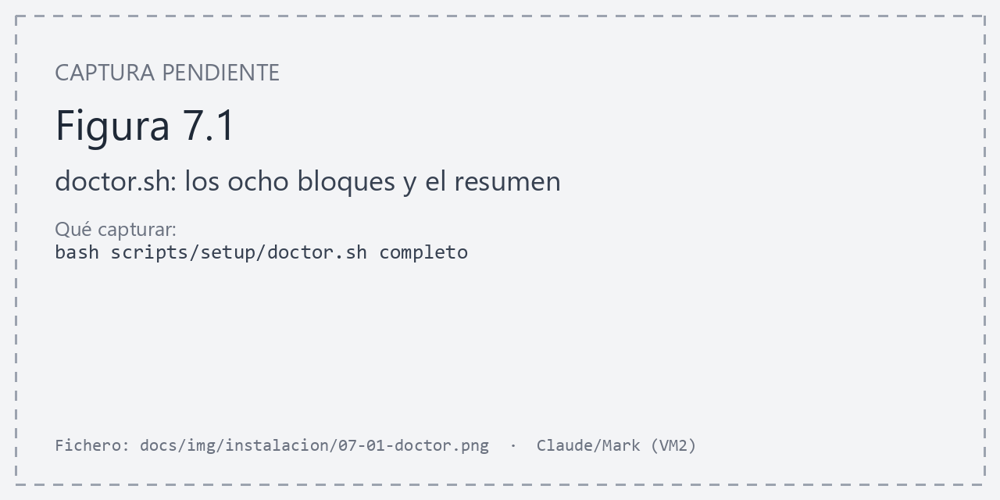

*Figura 7.1. `doctor.sh`: los ocho bloques y el resumen*

O pieza a pieza:

```bash
systemctl is-active cyberflow-capture-nic ppi-motor-capture ppi-motor
ls -la /var/lib/ppi-motor-capture/          # ficheros live-*.pcap rotando
tail -f logs/motor_decision.log             # decisiones, una por línea JSON
```

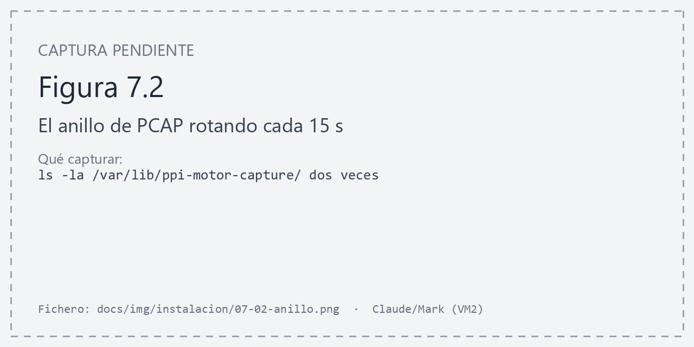

*Figura 7.2. El anillo de PCAP rotando cada 15 s*

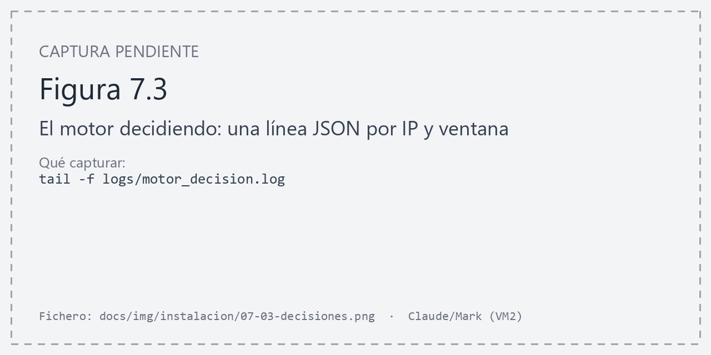

*Figura 7.3. El motor decidiendo: una línea JSON por IP y ventana*

Una decisión tiene esta forma:

```json
{"decision":"PERMIT","entity_ip":"10.10.40.10","score":2.41,
 "threshold":1.8126,"packet_count_10s":184,"window_end_utc":"..."}
```

(Ejemplo con el perfil genérico, OCSVM de laboratorio. Con el Isolation Forest
recalibrado el `threshold` es `-0.568892` y los `score` son negativos.)

En modo bloqueo, además:

```bash
sudo nft list set inet ppi_enforce bloqueadas
```

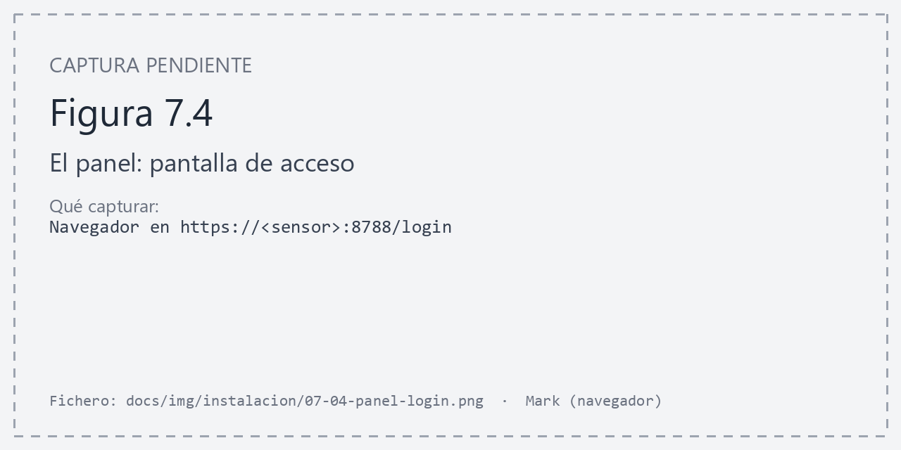

*Figura 7.4. El panel: pantalla de acceso*

---

## 8 · Recalibre. No se salte este paso

**El modelo publicado está entrenado con tráfico de un laboratorio concreto.**
En otra red, lo que allí era normal aquí puede no serlo.

Medición real de un despliegue sobre una red distinta, **sin ningún ataque en
curso**:

```
decisiones : 92 en 7 ventanas
  ALERT     85    92,4 %
  PERMIT     7     7,6 %
```

Las entidades señaladas eran las interfaces del propio cortafuegos emitiendo
sus anuncios CARP. **El 92,4 % eran falsos positivos.**

No es un defecto del motor: es lo que pasa cuando se aplica un umbral calibrado
en otro sitio (y, en ese caso, también sin excluir todavía el plano de control del
cortafuegos). Recalibre con tráfico normal **de su red**, sobre la línea base que el
acumulador va escribiendo en `artifacts/linea-base/multilayer-v3.csv`.

**Dos condiciones que impone el motor**, y que la secuencia de abajo cumple:

- **Contrato v2 (28 variables).** La línea base tiene 31 columnas (v3 = v2 + 3 de
  capa 2), pero el motor compara el esquema con su extractor v2 y aborta si no
  coinciden: se entrena con `configs/features/multilayer-v2.json`.
- **Un objeto con `score_samples` sobre datos crudos y el umbral en esa escala.**
  `entrenar_preliminar.py` guarda un *paquete* (modelo, escalador y umbral en
  `decision_function` por separado); `promover_preliminar.py` lo convierte en el
  `Pipeline` y el manifiesto que el motor carga.

```bash
# 1) Particionar por bloques temporales con banda de guarda (sin fuga entre
#    entrenamiento, validación y prueba).
python3 scripts/dataset/particionar_linea_base.py \
  --entrada artifacts/linea-base/multilayer-v3.csv \
  --salida  artifacts/linea-base/particionado.csv \
  --informe artifacts/linea-base/particion.json

# 2) Entrenar sobre `train` con el CONTRATO DEL MOTOR (v2) y CONGELAR el umbral en
#    el percentil alpha de `validation` -nunca de `test`-.
python3 scripts/modeling/entrenar_preliminar.py \
  --entrada artifacts/linea-base/particionado.csv \
  --schema  configs/features/multilayer-v2.json \
  --salida  artifacts/preliminar/if-AAAA-MM.joblib \
  --informe artifacts/preliminar/if-AAAA-MM.json

# 3) Promocionar: Pipeline + manifiesto, verificando orden de variables (paquete =
#    contrato = extractor del motor), hashes, conversión del umbral sin redondeo y
#    equivalencia. Escribe en rutas nuevas y no sobrescribe.
python3 scripts/modeling/promover_preliminar.py \
  --paquete  artifacts/preliminar/if-AAAA-MM.joblib \
  --informe  artifacts/preliminar/if-AAAA-MM.json \
  --detector if_recalibrado_AAAA_MM \
  --salida-modelo     artifacts/preliminar/if_recalibrado_AAAA_MM_desplegable.joblib \
  --salida-manifiesto artifacts/preliminar/manifest-if-recalibrado-AAAA-MM.json

# 4) Verificación independiente del par escrito: debe responder EQUIVALENTE.
python3 scripts/modeling/verificar_equivalencia_umbral.py \
  --modelo artifacts/preliminar/if_recalibrado_AAAA_MM_desplegable.joblib \
  --manifiesto artifacts/preliminar/manifest-if-recalibrado-AAAA-MM.json \
  --detector if_recalibrado_AAAA_MM --umbral-decision <umbral_decision_function del informe>
```

**5) Promocione con criterio y despliegue.** Confirme en el informe que el **FPR sobre
`test`** ronda `alpha` (0,05): esa es la señal de que el umbral generaliza. Solo
entonces apunte `configs/cyberflow.local.toml` al artefacto nuevo —`[rutas] modelo` y
`manifiesto`, `[motor] detector` con el mismo nombre y `calibrado_en_esta_red = true`—
y regenere las unidades, que pasan el **mismo detector al motor y al panel**:

```bash
cp configs/cyberflow.local.toml configs/cyberflow.local.toml.bak-$(date +%Y%m%d)
python3 scripts/setup/cyberflow_config.py --config configs/cyberflow.local.toml --mostrar
sudo .venv/bin/python scripts/setup/cyberflow_config.py --config configs/cyberflow.local.toml --escribir
sudo systemctl daemon-reload && sudo systemctl restart ppi-motor ppi-dashboard
```

El rollback es restaurar la copia del `.toml` y repetir esos tres últimos comandos.
Hasta que despliegue, el panel avisa en ámbar de que las alertas no son fiables — que
es lo correcto.

> **Y antes de recalibrar, asegúrese de tener tráfico que merezca llamarse
> línea base.** En una red sin usuarios, el 87 % de lo que ve el sensor es plano
> de control —STP, CARP, pfsync— y el modelo aprendería que lo normal es el
> latido de los switches.

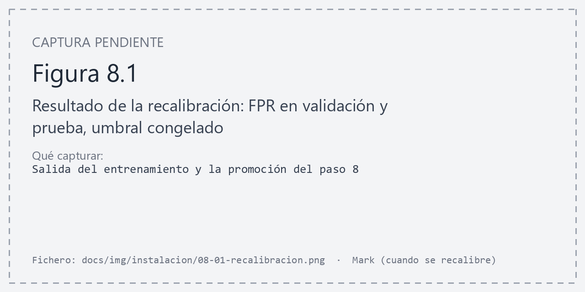

*Figura 8.1. Resultado de la recalibración: FPR en validación y prueba, umbral congelado*

---

## Anexo A · Instalar sin salida a Internet

Un sensor sin salida a Internet es una buena postura de seguridad, y es
compatible con instalarlo. Tres vías, de la más simple a la más aislada.

**Vía 0 — Internet temporal (lo más simple para un banco de pruebas).** En el
hipervisor, añada de forma temporal un adaptador con salida (NAT/puente),
instale, y quítelo:

```bash
sudo apt-get update && sudo apt-get install -y suricata
# ...instalado; retire el adaptador con Internet en el hipervisor.
```

**Vía 1 — Paquetes del sistema por túnel**, desde una máquina que sí tenga
salida y que **alcance al sensor**. El destino del reenvío `-R` se resuelve en el
CLIENTE ssh, así que el cliente debe ser la máquina con Internet:

```bash
# el túnel vive solo mientras dura el comando
ssh -R 18080:archive.ubuntu.com:80 -R 18081:security.ubuntu.com:80 \
    usuario@sensor "sudo apt-get update && sudo apt-get install -y suricata"
```

> Si el sensor solo se alcanza a través de un **bastión sin Internet**, el
> bastión NO sirve de cliente (no resolvería `archive.ubuntu.com`). Encadene
> desde la máquina con Internet con `-J bastión`, o use la Vía 0.

Apuntando temporalmente `/etc/apt/sources.list.d/ubuntu.sources` a
`http://127.0.0.1:18080/ubuntu/`.

> Use `archive.ubuntu.com`, no un espejo nacional: los espejos con
> *virtual host* rechazan la petición porque la cabecera `Host` pasa a ser
> `127.0.0.1:18080`.

**Dependencias de Python**, descargándolas donde haya red:

```bash
pip download --platform manylinux2014_x86_64 --python-version 3.12 \
    --only-binary=:all: --implementation cp \
    -r requirements-model.txt -d ruedas
# transfiera la carpeta y luego, en el sensor:
.venv/bin/python -m pip install --no-index --find-links ruedas -r requirements-model.txt
```

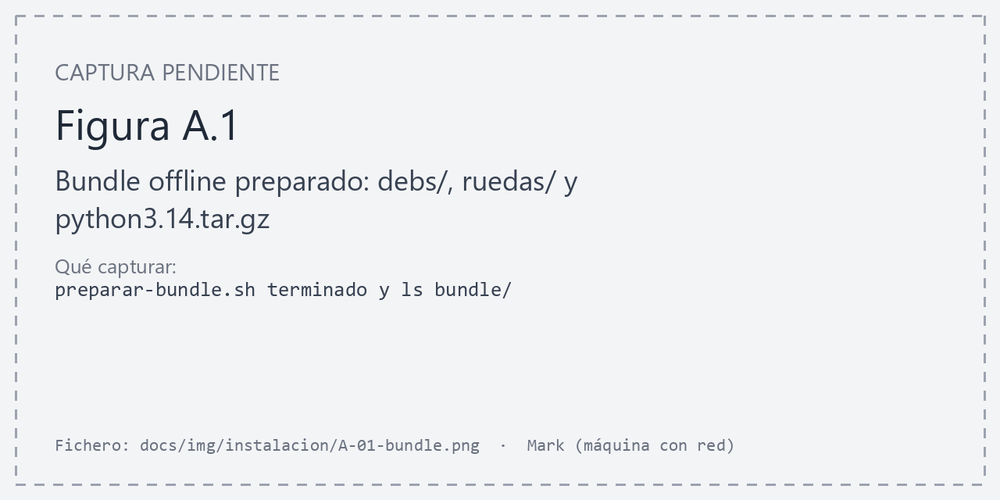

*Figura A.1. Bundle offline preparado: `debs/`, `ruedas/` y `python3.14.tar.gz`*

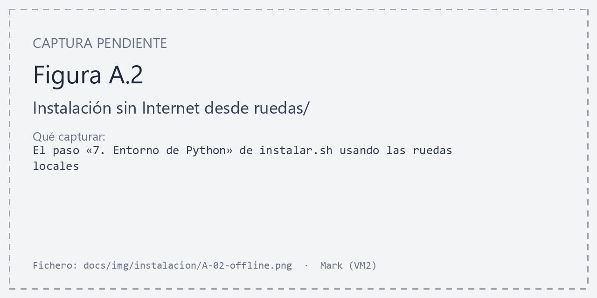

*Figura A.2. Instalación sin Internet desde `ruedas/`*

---

## Anexo B · La versión de Python importa, y más de lo que parece

`requirements-model.txt` fija CPython **3.14.4**. No es una formalidad ni una
preferencia: es un requisito medido.

### Lo que pasa si lo baja a 3.12

Para Python 3.12 no existe ninguna de las versiones fijadas:

| Fijado | Máximo para cp312 |
|---|---|
| `numpy==2.5.1` | 2.2.6 |
| `scikit-learn==1.9.0` | 1.7.2 |
| `scipy==1.18.0` | 1.16.3 |

El modelo **carga igual** con las versiones disponibles, y scikit-learn avisa:

```
Trying to unpickle estimator OneClassSVM from version 1.9.0 when using
version 1.7.2. This might lead to breaking code or invalid results.
```

Eso es lo visible. **Lo que no se ve es peor.**

### El fallo silencioso

Se recalibró el protocolo completo bajo 3.12 para comprobarlo. El OCSVM
desplegado conservó su resultado —158/179— y su umbral, y el LOF también. Los
otros cinco detectores cambiaron de umbral, aunque tres mantuvieron el mismo
número de detecciones, y **ningún modelo salió con el mismo hash**. Dos ramas
de Isolation Forest cambiaron incluso el resultado:

```
if_primary_weighted   97/179  ->  103/179
if_scaled_weighted    97/179  ->  103/179
```

Y el umbral del modelo ponderado pasó a ser **idéntico** al del no ponderado:

```
if_primary_weighted   antes -0.50606563   ahora -0.55456155
if_exact_collapsed    (sin ponderar)      ahora -0.55456155
```

La causa, comprobada directamente:

```python
>>> import sklearn; sklearn.__version__
'1.7.2'
>>> inspect.signature(IsolationForest.fit)
(self, X, y=None, sample_weight=None)
>>> # 300 filas, peso 20x en las primeras 50
>>> abs(sin_peso - con_peso).max()
0.0
```

**`IsolationForest.fit` acepta `sample_weight`, no avisa, no falla, y lo
ignora.** El protocolo de calibración pondera cada fila por
`1/filas_por_episodio` para corregir un desbalance medido —5 de 132 episodios
concentran el 31,7 % de las filas de entrenamiento—, y bajo 1.7.2 esa
corrección sencillamente no ocurre.

El resultado sigue saliendo. Los números siguen siendo plausibles. Nada indica
que la ponderación se haya perdido.

### Qué hacer

- **Para desplegar y ver el sistema funcionando**, 3.12 sirve **con el perfil
  genérico**: el OCSVM que corre el motor en ese perfil reproduce exacto. Un Isolation
  Forest recalibrado —como el de Sensor1— debe ejecutarse en el mismo entorno congelado
  en que se entrenó: este anexo muestra que un IF bajo otra versión de scikit-learn
  cambia de resultado sin avisar.
- **Para calibrar, reentrenar o publicar cualquier cifra**, use 3.14.4. El
  guardarraíl `EXPECTED_PYTHON` del script de calibración se lo va a exigir, y
  está ahí por esto.
- Si cambia de entorno, **no se fíe de que los números salgan**: compruebe que
  salen *los mismos*. Un parámetro ignorado en silencio no se detecta de
  ninguna otra forma.

### Instalar CPython 3.14.4

Ubuntu 24.04 solo trae 3.12, y el PPA *deadsnakes* publica 3.14.6 — que el
guardarraíl rechaza, porque compara la versión completa. Hay que compilarla:

```bash
sudo apt-get install -y build-essential zlib1g-dev libssl-dev libffi-dev     libbz2-dev liblzma-dev libsqlite3-dev libreadline-dev libncurses-dev     uuid-dev libgdbm-dev pkg-config

curl -LO https://www.python.org/ftp/python/3.14.4/Python-3.14.4.tgz
tar xzf Python-3.14.4.tgz && cd Python-3.14.4
./configure --prefix=/opt/python3.14 --with-ensurepip=install
make -j"$(nproc)"
sudo make altinstall          # altinstall: no toca el python3 del sistema
```

Unos diez minutos en 4 vCPU. Después:

```bash
/opt/python3.14/bin/python3.14 -m venv .venv
.venv/bin/python -m pip install -r requirements-model.txt
```

> En una máquina sin salida a Internet, descargue el `.tgz` y las ruedas de
> `cp314` donde haya red y transfiéralos. Ver el anexo A.

### Verificado

El protocolo completo se reejecutó sobre un CPython 3.14.4 recién compilado, en
una máquina distinta y con otra versión de glibc (2.39 frente a 2.43). Los
siete detectores reprodujeron su resultado y su umbral **hasta el último
decimal**, y los siete modelos salieron con **hash idéntico**:

```
if_primary_weighted   97/179 ->  97/179   umbral -0.506065635 -> -0.506065635
ocsvm_scaled         158/179 -> 158/179   umbral +1.812608794 -> +1.812608794
REPRODUCCION EXACTA DEL PROTOCOLO: SI
```

Con el entorno correcto, lo publicado se reproduce. Con el entorno equivocado,
casi — y ese *casi* es el problema.

### Bit a bit depende también de la CPU

El CI recalibra el modelo en cada cambio, en un runner de GitHub con un AMD
EPYC 7763. Ahí los siete detectores dan **las mismas detecciones**, y cinco
reproducen bit a bit, pero dos difieren en el último bit del umbral:

```
lof_scaled                 diferencia relativa 2,7e-15
elliptic_envelope_scaled   diferencia relativa 5,5e-11
```

La causa es OpenBLAS: elige un kernel distinto según el procesador, y el
manifiesto se generó con el kernel `SkylakeX` (AVX-512) que ese AMD no tiene.
Cambia el orden de las sumas en coma flotante, y con él el último bit, en los
dos detectores con más álgebra lineal.

Por eso `scripts/analysis/verificar_reproduccion.py` distingue dos niveles:

| Nivel | Qué exige | Cuándo |
|---|---|---|
| Funcional | mismas detecciones y umbrales dentro de 10⁻⁹ relativo | siempre |
| Bit a bit | umbral y hash del modelo idénticos | si el BLAS coincide con el del manifiesto |

La tolerancia no esconde lo que importa: el fallo de `sample_weight` movía el
umbral un 10 % y cambiaba el resultado, y sigue fallando.

---

## Anexo C · Despliegue en un entorno real (sensor aislado)

Un sensor de seguridad **no debe tener salida a Internet**. Entonces, ¿cómo
llegan el código, Suricata y las dependencias de Python? El principio es siempre
el mismo: **se obtienen en una zona con conexión y se transfieren al sensor por
la red interna o por un medio aprobado. El sensor nunca toca Internet.**

> **Atajo automatizado:** `scripts/setup/preparar-bundle.sh` hace las tres cosas
> de golpe en un host de construcción Ubuntu 24.04 (o un contenedor
> `ubuntu:24.04`): descarga los `.deb` de Suricata, compila Python 3.14 y baja
> las ruedas `cp314`. Produce una carpeta `bundle/` que se transfiere al sensor.
> Ver el encabezado del script. Lo de abajo explica cada pieza por separado.

Hay que llevar tres piezas. Para cada una, de más simple a más aislado:

### 1 · El código (este repositorio)

- **Mirror Git interno** (GitLab/Gitea/Bitbucket en la LAN, sincronizado con
  GitHub desde una zona con salida): el sensor hace `git clone` del mirror
  interno, no de GitHub. *Recomendado a escala.*
- **Staging host**: una máquina con Internet clona el repo (o descarga el tarball
  del Release) y se transfiere al sensor por la red interna:
  ```bash
  # en la máquina con Internet:
  git clone https://github.com/.../VF-Sistema-...-Redes-de-Datos.git cyberflow
  tar czf cyberflow.tgz cyberflow
  # transferir por el bastión y, en el sensor:
  tar xzf cyberflow.tgz
  ```
  *Es el método usado en este laboratorio (air-gap).*
- **Release tarball**: descargar el `.tar.gz` del GitHub Release una vez y
  llevarlo.

### 2 · Suricata (paquetes del sistema)

- **Proxy o mirror APT interno**: el sensor apunta a él (no a Internet).
- **Bundle de `.deb`**: en una máquina conectada, `apt-get download suricata` y
  sus dependencias (libhtp2, libhyperscan5, libhiredis, libluajit, libevent…) →
  transferir → instalar con **`sudo dpkg -i *.deb`** (dos pasadas, y luego
  `sudo dpkg --configure -a`). **No** uses `apt-get install ./*.deb` sin red:
  intenta contactar los mirrors y se cuelga.

### 3 · Python y sus dependencias

- **Mirror PyPI interno** (devpi/Nexus): `pip install` apunta ahí.
- **Ruedas offline**: en una máquina conectada, con el intérprete correcto
  (3.14), `pip download -r requirements-model.txt -d ruedas/` → transferir la
  carpeta `ruedas/`. **El instalador la usa automáticamente si existe.**
- **Python 3.14**: desde un paquete interno, o compilarlo una vez (anexo B) y
  distribuir `/opt/python3.14`.

### En resumen

Los cuatro patrones habituales —salida por **proxy** controlado, **mirror
interno**, **imagen dorada**/automatización, o **bundle air-gap**— mantienen el
sensor aislado. `instalar.sh` **no necesita Internet**: usa `ruedas/` y los
paquetes ya presentes. El único requisito es haber **traído** esas piezas desde
una zona conectada. En este laboratorio, ese "traer" se hace copiando el bundle
ya preparado de un sensor gemelo; en producción, del mirror o del bundle
versionado del release.
