# Informe de resultados y evaluación crítica de la tesis: Detección temprana de comportamientos anómalos en redes de datos mediante modelos predictivos y un mecanismo de control inline

| | |
|---|---|
| **Estudiante** | Rubén Mark Salazar Tocas |
| **Asesores** | Ing. Nemias Saboya Ríos · Ing. Fernando Manuel Asin Gómez |
| **Institución** | Universidad Peruana Unión |
| **Fecha** | 19 de agosto de 2026 |
| **Estructura** | Parte I: resultados obtenidos · Parte II: evaluación crítica de esos resultados |

**Trazabilidad.** Todas las cifras salen de artefactos verificables: `artifacts/model/manifest.json`, `artifacts/model/ocsvm_scaled.joblib`, `artifacts/dataset/*.csv` y `results/f6/f6_resultados.jsonl`. Las gráficas y los intervalos de confianza se regeneran con:

```bash
.venv/bin/python3 scripts/entregables/generar_graficas.py
```

**Verificación de integridad.** Al re-puntuar los conjuntos con el modelo congelado, este informe reproduce **exactamente** las métricas del manifiesto (13/276 falsos positivos y 158/179 detecciones), lo que confirma de forma independiente que el modelo publicado reproduce sus propios resultados.

---
---

# PARTE I — RESULTADOS

## 1. Qué se construyó

Sistema de detección de anomalías de red desplegado sobre un laboratorio virtualizado de 5 máquinas, con el sensor actuando como router inline entre LAN y DMZ:

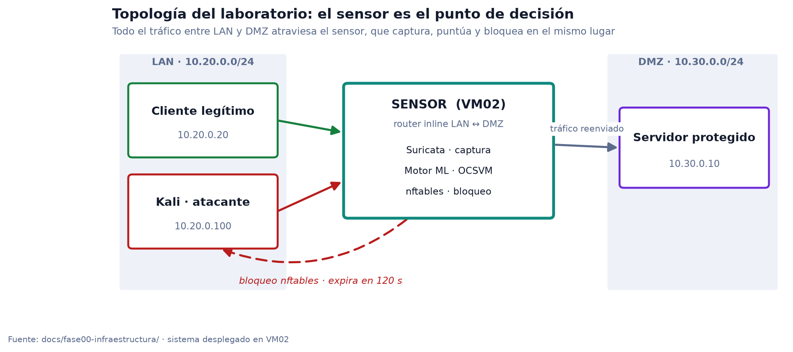

| Componente | Estado |
|---|---|
| Dataset multicapa (28 features, L3/L4/L7) | Consolidado y auditado |
| Modelo OCSVM | Congelado, umbral calibrado |
| Motor de decisión en tiempo real | Desplegado y activo (VM02) |
| Bloqueo inline (nftables) | Activo, expiración 120 s |
| Panel de observación | Activo, solo lectura |

## 2. Dataset y variables

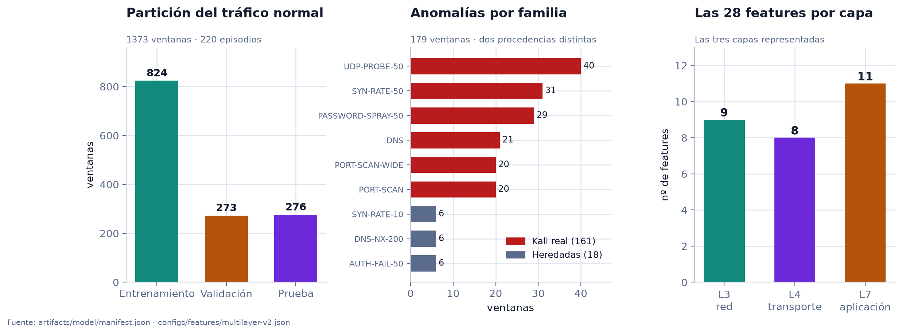

| Magnitud | Valor |
|---|---|
| Ventanas normales / episodios | 1 373 / 220 |
| Partición (entrenamiento / validación / prueba) | 824 / 273 / 276 ventanas · 132 / 44 / 44 episodios |
| Ventanas de ataque / episodios | 179 / 132 |
| Procedencia de los ataques | 161 desde Kali real · 18 heredadas de otro mecanismo |
| Features por capa | L3 = 9 · L4 = 8 · L7 = 11 (total 28) |
| Integridad | `gates.pass = true`, `no_episode_split = true`, SHA-256 registrado |

## 3. Desempeño del modelo congelado

`Pipeline(StandardScaler → OneClassSVM(rbf, ν=0.05))`, umbral `score < 1,8126` fijado por cuantil α = 0,05 sobre validación.

### 3.1 Capacidad discriminante

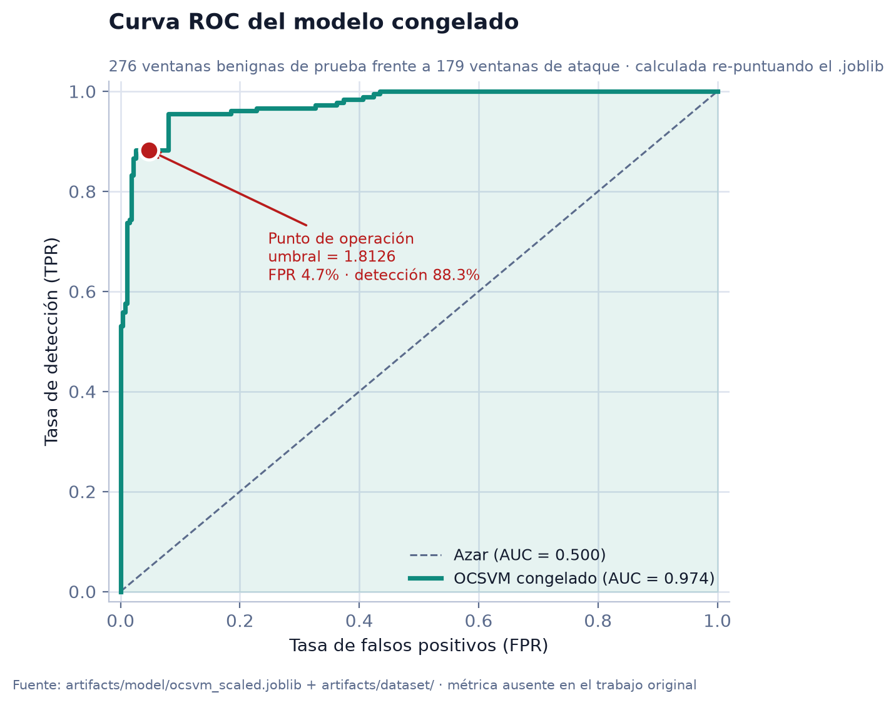

**ROC-AUC = 0,974.** Métrica calculada en este informe: el trabajo original nunca la computó. Indica que el modelo ordena correctamente casi cualquier par (benigno, anómalo), independientemente del umbral elegido.

### 3.2 Dónde está el umbral y por qué hay errores

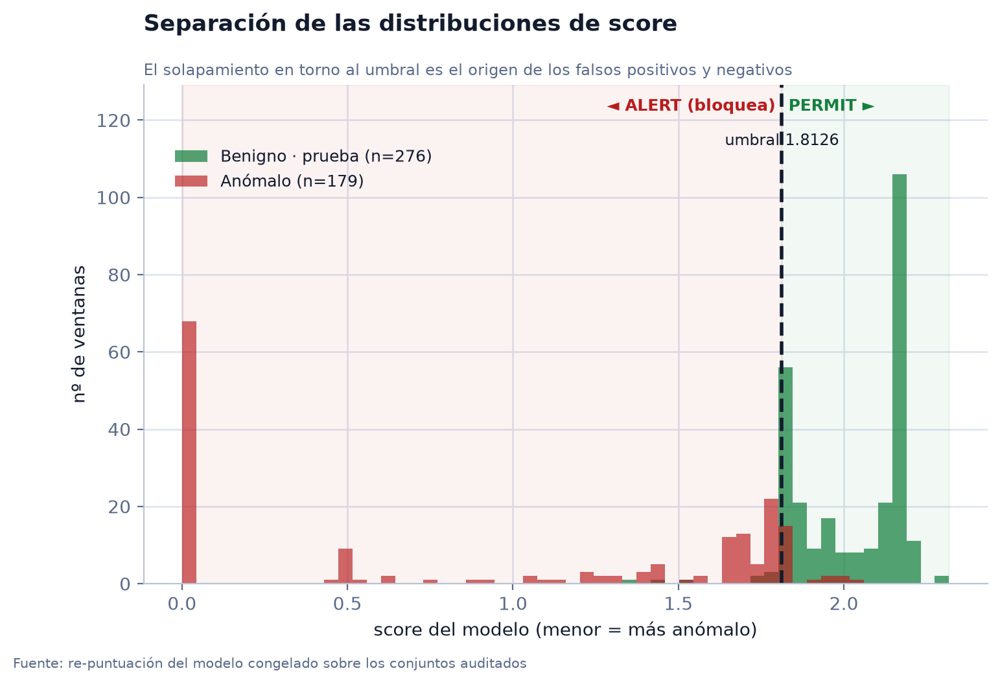

Las dos poblaciones se separan bien en conjunto, pero **se solapan en la franja 1,6 – 2,0**, justo donde cae el umbral. Ese solapamiento es el origen material de los falsos positivos y negativos.

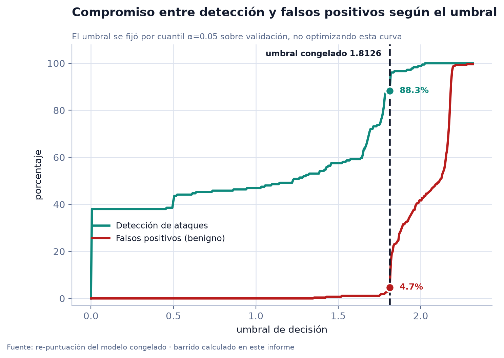

### 3.3 Resultado en el punto de operación

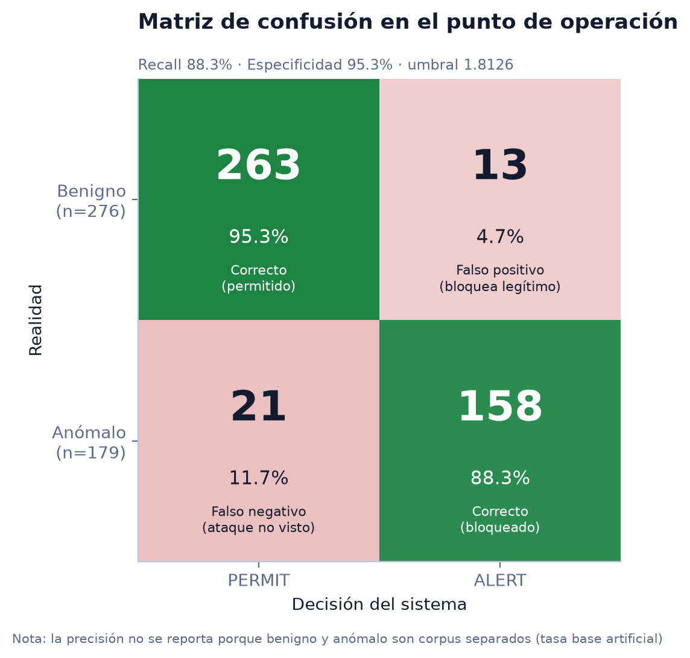

| Métrica | Valor | k / n | IC 95 % (Wilson) |
|---|---|---|---|
| **ROC-AUC** | **0,974** | — | *(calculada aquí)* |
| Detección global (recall) | 88,3 % | 158/179 | 82,7 % – 92,2 % |
| Detección Kali-real | 88,8 % | 143/161 | 83,0 % – 92,8 % |
| Detección heredada | 83,3 % | 15/18 | 60,8 % – 94,2 % |
| Detección por episodio | 90,2 % | 119/132 | 83,9 % – 94,2 % |
| Especificidad | 95,3 % | 263/276 | — |
| Falsos positivos (FPR) | 4,71 % | 13/276 | 2,8 % – 7,9 % |
| F1 | 0,903 | — | *(tasa base artificial, ver §8)* |

## 4. Comparación de modelos

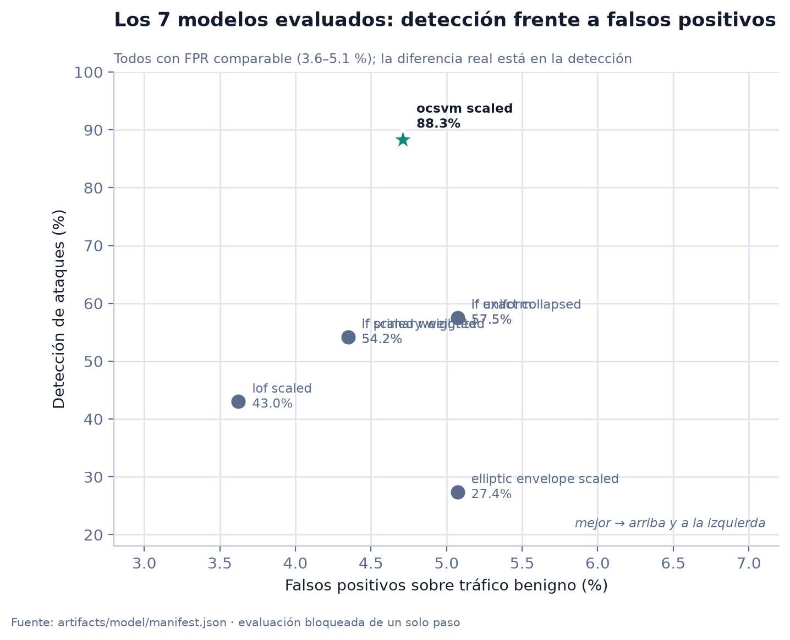

Siete configuraciones de cuatro familias de algoritmos, evaluadas en un solo paso bloqueado. Todas con FPR comparable (3,6 – 5,1 %); **la diferencia real está en la detección**.

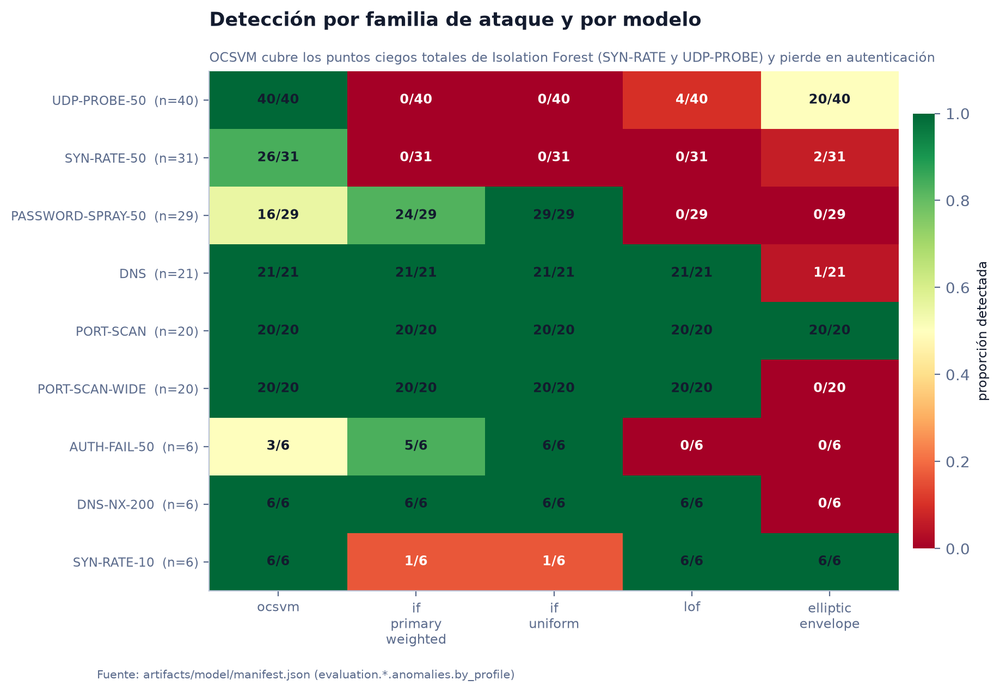

| Modelo | Umbral | FPR test | Detección | Kali-real |
|---|---|---|---|---|
| **`ocsvm_scaled`** *(congelado)* | **1,8126** | **4,71 %** | **88,3 %** | **88,8 %** |
| `if_uniform` | −0,5543 | 5,07 % | 57,5 % | 55,9 % |
| `if_exact_collapsed` | −0,5543 | 5,07 % | 57,5 % | 55,9 % |
| `if_primary_weighted` *(rol registrado: primary)* | −0,5061 | 4,35 % | 54,2 % | 52,8 % |
| `if_scaled_weighted` | −0,5042 | 4,35 % | 54,2 % | 52,8 % |
| `lof_scaled` | −2,9405 | 3,62 % | 43,0 % | 40,4 % |
| `elliptic_envelope_scaled` | −4,0 × 10⁹ | 5,07 % | 27,4 % | 26,7 % |

**Hallazgo:** Isolation Forest tiene **dos puntos ciegos totales** —0/31 en SYN-RATE y 0/40 en UDP-PROBE, 71 ventanas sin detectar ninguna— que OCSVM resuelve. A cambio, OCSVM pierde en las familias de autenticación.

## 5. Resultados en operación real (validación F6)

Sistema desplegado, motor y enforcement activos: 2 pases de 29 corridas + 2 pruebas de aislamiento.

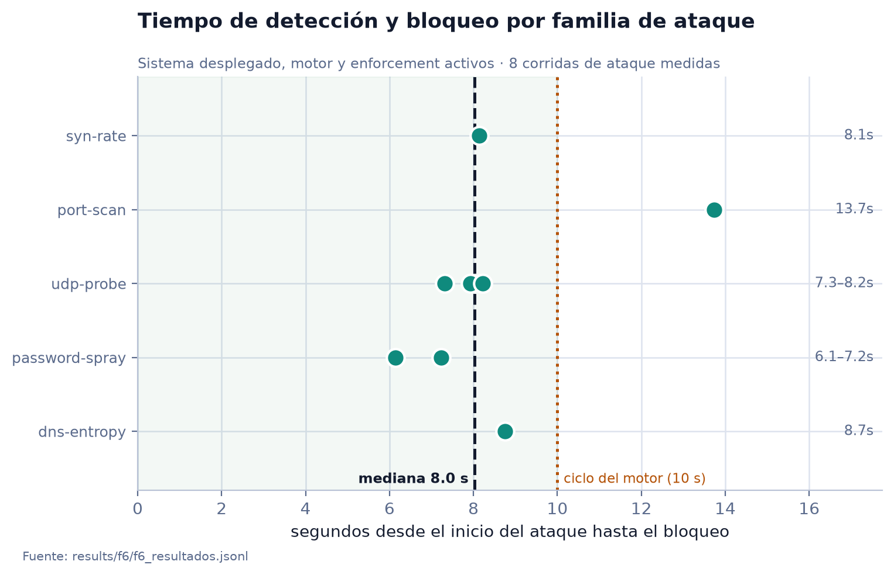

| Métrica operativa | Resultado |
|---|---|
| Lead-time de detección y bloqueo | **mediana 8,0 s** (rango 6,1 – 13,7 s) |
| Disponibilidad de servicios | **100 %** en 57 corridas |
| Pérdida de paquetes en captura | **0 drops** |

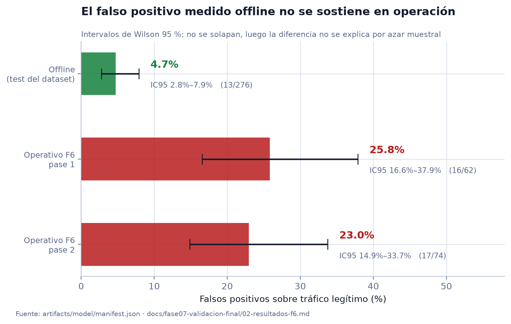

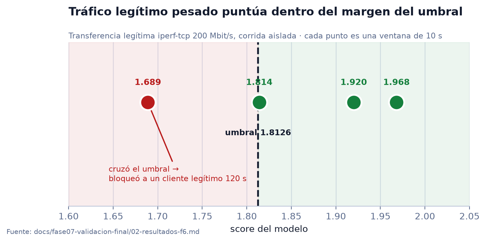

**Resultado negativo, reportado como tal:** el FPR benigno **no se sostiene** en operación. En aislamiento, una transferencia legítima `iperf-tcp 200M` produjo una ventana de score 1,689 que cruzó el umbral y **bloqueó a un cliente legítimo durante 120 s**.

El margen es además extremadamente estrecho: otra ventana de la misma transferencia legítima obtuvo 1,814 y **se permitió por 0,0014 puntos de score**. No es que el sistema distinga bien el tráfico pesado y falle en un caso aislado: es que las cuatro ventanas caen dentro del margen de decisión, y cuál se bloquea depende de fluctuaciones mínimas.

> **[ESPACIO PARA CAPTURA 1 — Panel operativo]**
> Insertar aquí una captura de `http://127.0.0.1:8788/` mostrando salud de servicios, distribución de scores y decisiones recientes.

> **[ESPACIO PARA CAPTURA 2 — Bloqueo en vivo]**
> Insertar aquí una captura de la sección "IPs bloqueadas ahora" durante un ataque, o la salida de `sudo ppi-enforce list`.

---
---

# PARTE II — EVALUACIÓN CRÍTICA

Criterios aplicados: **validez** (¿las conclusiones se siguen de la evidencia?), **confiabilidad** (¿son reproducibles?) y **evaluación técnica** (¿funciona en las condiciones previstas?).

## 6. Veredicto por criterio

| Criterio | Veredicto | Razón |
|---|---|---|
| Validez interna | **Parcial** | Controles anti-fuga reales y verificados, pero el modelo final se eligió observando el conjunto de prueba |
| Validez externa | **Insuficiente** | Refutada por el propio proyecto sobre tráfico legítimo pesado |
| Validez de constructo | **No demostrada** | La ablación exigida por el jurado nunca se ejecutó |
| Confiabilidad | **Alta** | Hashes, particiones disjuntas por episodio, causalidad probada con test unitario |
| Evaluación técnica | **Alta** | Funciona, se midió en despliegue real, sus fallos se corrigieron con evidencia |

## 7. Lo que está validado con evidencia

| Aspecto | Evidencia |
|---|---|
| Particiones disjuntas por episodio | `manifest.audit_gates.no_episode_split = true` |
| Umbral fijado solo en validación, evaluación bloqueada de un paso | α = 0,05, k = 13, desigualdad estricta |
| Causalidad temporal (sin información futura) | Test unitario: un HTTP 500 posterior no altera una ventana cerrada |
| Reproducibilidad de artefactos | SHA-256 de CSV, calibrador y modelos; git limpio verificado |
| El modelo reproduce sus propias métricas | Re-puntuación en este informe: 13/276 y 158/179 exactos |
| Detección de 5 familias de ataque reales | 88,8 % Kali-real [83,0 – 92,8] |
| Detección y bloqueo en tiempo real | Mediana 8,0 s; disponibilidad 100 % |
| Corrección de 3 fallos reales de producción | Bucle de re-bloqueo, falso positivo por desincronización, replay de backlog |
| Detección honesta de una fuga propia | Resultado contaminado marcado *"no debe citarse"* |
| Trazabilidad | 330 commits · 181 documentos de campaña · 162 revisiones adversariales |

## 8. Debilidades detectadas

### 8.1 Metodológicas

**D1 · La selección del modelo se hizo sobre el conjunto de prueba.** *(severidad alta)*
El propio `manifest.json` registra:

> `model_selection_policy`: *"if_primary_weighted es la conclusion principal; LOF/OCSVM (…) no lo reemplazan por ganar una metrica posterior en test o evaluation_only."*

y asigna a `ocsvm_scaled` el rol `sensitivity_or_comparator`. **El modelo congelado es el comparador que esa política prohibía promover.** Consecuencia: el 88,3 % (y el AUC de 0,974) son el máximo sobre 7 candidatos evaluados en los mismos conjuntos, sin datos reservados que permitan una estimación insesgada.
→ *Solución:* declararlo explícitamente. La corrección completa exige `PM-multilayer-v2-v2` con evaluación nueva (semanas). **Matiz importante:** la superioridad sobre Isolation Forest sí es sólida — 88,3 % [82,7–92,2] frente a 54,2 % [46,9–61,3], intervalos que no se solapan.

**D2 · No se calculó ninguna medida de incertidumbre.** *(severidad alta)*
No había intervalos de confianza, errores estándar ni pruebas de significancia. Los de este informe son un aporte propio, y revelan lo que las cifras puntuales ocultaban:

| Cifra reportada | IC 95 % real | Lectura |
|---|---|---|
| "50 % en AUTH-FAIL" (3/6) | **18,8 % – 81,2 %** | 62,5 puntos de ancho: **no sostiene ninguna conclusión** |
| "55,2 % en PASSWORD-SPRAY" (16/29) | 37,5 % – 71,6 % | Muy amplio; conclusión débil |
| 88,3 % detección global (158/179) | 82,7 % – 92,2 % | Sólido |
| 4,71 % FPR (13/276) | 2,8 % – 7,9 % | Sólido, pero ver D5 |

→ *Solución:* incorporarlos (hecho aquí, coste: minutos).

**D3 · La ablación exigida por el jurado nunca se ejecutó.** *(severidad alta)*
El requisito pedía comparar cuatro configuraciones (Base 14 · +L3 · +L3+L4 · Multicapa) y retirar cada grupo de capa por separado. Sigue marcada *"Planificado"*; no existe script ni artefacto. **Ninguna de las 28 features ha demostrado empíricamente que se gana su lugar.** Además hay 6 pares con |r| > 0,8 (redundancia ya medida).
→ *Solución:* ejecutarla — 1-2 días, sin campañas nuevas.

**D4 · El análisis de sensibilidad no cubre el modelo elegido.** *(severidad media)*
Las 10 semillas, la ponderación por episodio y el colapso de duplicados se aplicaron **solo a Isolation Forest** (`manifest.stability` no contiene `ocsvm_scaled`). OCSVM además se ajustó **sin ponderación**, pese al desbalance documentado: *"5/132 episodios (3,8 %) concentran 261/824 filas train (31,7 %)"*.
→ *Solución:* estabilidad por submuestreo — horas.

### 8.2 De validez externa

**D5 · El FPR offline no se sostiene en operación.** *(severidad alta — la más importante)*

| Condición | FPR | IC 95 % |
|---|---|---|
| Offline (test) | 4,71 % | 2,8 % – 7,9 % |
| Operativo F6 pase 1 | 25,8 % | 16,6 % – 37,9 % |
| Operativo F6 pase 2 | 23,0 % | 14,9 % – 33,7 % |

**Los intervalos no se solapan**: no se explica por azar. Y no es artefacto de campaña — se reprodujo en aislamiento. Contradice la observación del jurado que motivó todo el esfuerzo del dataset.
→ *Solución:* recalibrar incluyendo tráfico pesado (1-2 semanas). Mientras tanto, **declararlo**: un FPR medido y admitido es más defendible que uno refutado por la evidencia propia.

**D6 · La división es por índice de repetición, no por sesión independiente.** *(severidad alta)*
R01–R03 → entrenamiento, R04 → validación, R05 → prueba. **Los 38 perfiles aparecen en las tres particiones**: se mide repetibilidad del escenario, no generalización. No existe la **jornada de holdout temporal externa** que el jurado exigió. Explica en buena parte D5.
→ *Solución:* capturar una jornada nueva como holdout externo — días.

**D7 · Cobertura de escenarios incompleta.** *(severidad media)*
De los 14 escenarios normales exigidos faltan **SSH, SCP/SFTP, SMB, respaldo, streaming y actualizaciones**, y no hay captura multi-SO.
→ *Solución:* declarar como límite de alcance salvo exigencia expresa.

### 8.3 De constructo y documentación

**D8 · Sin diccionario de fórmulas para las features 15–28.** *(severidad media)* — El jurado pidió *"diccionario, fórmulas, unidades y ventanas"*. Solo existe para las 14 de v1. → *Solución: publicarlo extrayéndolo del extractor — horas.*

**D9 · Una feature es constante y no observable.** *(severidad media)* — `tls_handshake_failure_ratio_60s` vale 0,0 en todo el dataset; se demostró que Suricata no puede producir el evento intermedio. → *Solución: declararla no observable y reportar 27 features efectivas.*

**D10 · Los gates no cubren duplicados ni constantes.** *(severidad baja)* — `gates.pass = true` convive con 22 vectores duplicados exactos y una feature constante. → *Solución: declararlo.*

### 8.4 Del mecanismo de control

**D11 · El costo de un falso positivo es alto y está demostrado** — un FP corta el servicio a un cliente legítimo 120 s. Combinado con D5, es el principal riesgo operativo.
**D12 · Bloqueo por IP** — inefectivo ante rotación de IP; limitación estructural, declarable.
**D13 · Sin nivel intermedio de respuesta** (tipo limitación de tasa) — exigiría un segundo umbral calibrado.
**D14 · El heurístico de fuerza bruta no está calibrado estadísticamente** — sus umbrales (≥5 peticiones, ≥80 % de 401/403) son criterio razonado; está declarado en el código.

## 9. ¿Los resultados cumplen el objetivo?

**Componente 1 — Detectar y bloquear en tiempo real: CUMPLIDO.**
Detección del 88,8 % [83,0–92,8] sobre ataques genuinos, ROC-AUC 0,974, bloqueo en mediana de 8 s, disponibilidad 100 %.

**Componente 2 — Sin penalizar el tráfico legítimo: NO DEMOSTRADO.**
23–26 % de FPR operativo y un falso positivo reproducido en aislamiento. El sistema **no es apto para operación desatendida** en redes con transferencias pesadas legítimas.

**Veredicto.** El proyecto cumple su objetivo **como demostración de viabilidad técnica**, no como sistema de producción. Esa distinción no debilita la tesis si se declara, porque el criterio de finalización adoptado no fue *"demostrar que el sistema siempre acierta"* sino *"delimitar con evidencia qué detecta, bajo qué condiciones funciona y qué limitaciones conserva"*.

Lo que sí compromete la calidad académica no es el falso positivo —está medido y es defendible— sino **la ablación ausente y la falta de cuantificación de incertidumbre**, porque afectan a la validez de las conclusiones, no al desempeño del artefacto.

## 10. Priorización antes de cerrar la tesis

**Bloque A — horas (imprescindible).**

| # | Acción | Resuelve |
|---|---|---|
| 1 | Publicar diccionario de fórmulas de features 15–28 | D8 |
| 2 | Incorporar los IC de Wilson a toda proporción | D2 |
| 3 | Sustituir conclusiones con n ≤ 6 por declaración de insuficiencia muestral | D2 |
| 4 | Declarar selección post hoc, separación 161/18 y FPR operativo | D1, D5 |
| 5 | Actualizar la matriz de cumplimiento del jurado (está obsoleta) | — |

**Bloque B — 1 a 2 días (alto retorno).**

| # | Acción | Resuelve |
|---|---|---|
| 6 | **Ejecutar la ablación L3/L4/L7 y la comparación 14 vs 28** | D3 |
| 7 | Estabilidad por submuestreo del OCSVM | D4 |

**Bloque C — si el calendario lo permite.**

| # | Acción | Resuelve |
|---|---|---|
| 8 | Jornada nueva como holdout temporal externo | D6 |
| 9 | Recalibrar incluyendo tráfico pesado y repetir F6 | D5 |

> **Mínimo defendible: Bloque A + punto 6.** Cubre los dos requisitos formales incumplidos y corrige la principal deficiencia de inferencia, sin experimentación nueva.

## 11. Limitaciones de este propio informe

- No se auditó el código del extractor línea por línea; la confianza en las 28 features descansa en los tests unitarios existentes.
- **No se evaluó el sistema como objetivo de ataque** (evasión del detector, o abuso del bloqueo para provocar denegación de servicio contra terceros suplantando IP). Omisión relevante; debería ser trabajo futuro.
- El acceso administrativo permanente sin restricción vigente durante el desarrollo contradice la evidencia de aislamiento de fases previas. **Se recomienda revertirlo antes de la defensa.**
- El ROC-AUC de 0,974 calculado aquí se apoya en los mismos conjuntos usados para seleccionar el modelo, por lo que hereda el sesgo optimista de D1.

## 12. Conclusión

El proyecto entrega un sistema real, desplegado, instrumentado y medido, con trazabilidad y honestidad experimental superiores a lo habitual. Sus dos deficiencias son de naturaleza distinta: la **falta de validez externa sobre tráfico pesado** está medida y es defendible como límite conocido; la **ausencia de ablación y de cuantificación de incertidumbre** es una deficiencia del análisis, y es la más barata de corregir.

Corregidas, la tesis sostiene con solidez una afirmación acotada y verdadera:

> Se demostró la viabilidad de detectar comportamientos anómalos y ejercer control inline en tiempo real sobre una red real, con ROC-AUC de 0,974, detección del 88,8 % [83,0 – 92,8] sobre ataques genuinos y bloqueo en una mediana de 8 segundos; y se delimitó con evidencia la condición bajo la cual el sistema todavía no es apto para operación desatendida: el tráfico legítimo de alto volumen, donde el falso positivo operativo alcanza 23–26 %.

---

## Anexo A — Índice de gráficas

| Figura | Muestra | Fuente |
|---|---|---|
| `A1-curva-roc.png` | Capacidad discriminante (AUC 0,974) y punto de operación | Re-puntuación del `.joblib` |
| `A2-distribucion-scores.png` | Solapamiento entre benigno y anómalo en torno al umbral | Re-puntuación del `.joblib` |
| `A3-matriz-confusion.png` | Aciertos y errores en el punto de operación | Re-puntuación del `.joblib` |
| `A4-barrido-umbral.png` | Compromiso detección/falsos positivos según umbral | Re-puntuación del `.joblib` |
| `B1-comparacion-modelos.png` | Los 7 modelos: detección frente a FPR | `manifest.json` |
| `B2-heatmap-familias.png` | Detección por familia y modelo; puntos ciegos de IF | `manifest.json` |
| `C1-fpr-offline-vs-operativo.png` | El FPR offline no se sostiene en operación | `manifest.json` + F6 |
| `C2-lead-time.png` | Tiempo hasta el bloqueo por familia | `f6_resultados.jsonl` |
| `C3-scores-trafico-pesado.png` | Tráfico legítimo pesado dentro del margen del umbral | F6 |
| `D1-composicion-dataset.png` | Particiones, familias de ataque y features por capa | `manifest.json` + contrato |
| `E1-topologia.png` | Topología del laboratorio y punto de decisión | `docs/fase00-infraestructura/` |

## Anexo B — Trazabilidad

| Artefacto | Identificador |
|---|---|
| Commit del calibrado | `9467066a8d85fda8e176a6629e5f70c94c04eff0` (git limpio antes y después) |
| SHA-256 del calibrador | `81836b625887bfc84376e93334b29796573b20d990e81684d9a7ba7e38897980` |
| Modelo congelado | `artifacts/model/ocsvm_scaled.joblib` |
| Manifiesto de calibración | `artifacts/model/manifest.json` (2026-08-17) |
| Resultados de F6 | `results/f6/f6_resultados.jsonl` |
| Reproducción de gráficas e IC | `scripts/entregables/generar_graficas.py` |

## Anexo C — Evidencia documental citada

- `docs/fase03-dataset/180-consolidacion-dataset-v2-ampliado.md` — consolidación y auditoría del dataset
- `docs/fase03-dataset/175-limite-tls-handshake-failure-ratio.md` — feature no observable (D9)
- `docs/fase04-modelado/03-diagnostico-pipeline-multilayer-v2.md` — redundancia entre features y fuga detectada
- `docs/fase04-modelado/05-resultado-calibracion-multilayer-v2-v1.md` — comparación de los 7 modelos
- `docs/fase04-modelado/06-modelo-final-congelado-ocsvm.md` — modelo congelado
- `docs/fase05-motor-tiempo-real/` — motor, enforcement y fallos de producción corregidos
- `docs/fase07-validacion-final/02-resultados-f6.md` — validación del sistema desplegado
- `docs/requisitos-jurado/README.md` — requisitos y matriz de cumplimiento
- `docs/07-mejoras-futuras/01-debilidades-y-mejoras.md` — registro vivo de debilidades
