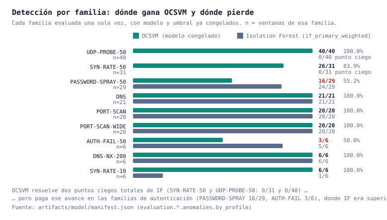
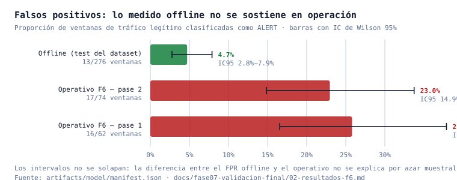
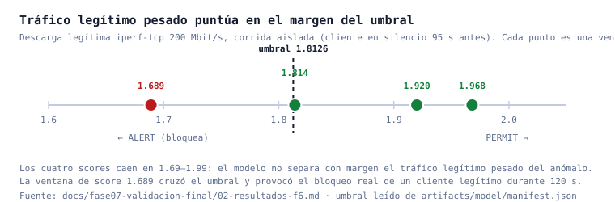

# Informe de evaluación crítica de la tesis: Detección temprana de comportamientos anómalos en redes de datos mediante modelos predictivos y un mecanismo de control inline

| | |
|---|---|
| **Estudiante** | Rubén Mark Salazar Tocas |
| **Asesores** | Ing. Nemias Saboya Ríos · Ing. Fernando Manuel Asin Gómez |
| **Institución** | Universidad Peruana Unión |
| **Fecha del informe** | 19 de agosto de 2026 |
| **Estado del sistema evaluado** | Desplegado y operativo (VM02), modelo congelado, validación final F6 ejecutada |
| **Naturaleza de este documento** | Autoevaluación crítica, no un resumen de logros |

---

## 1. Propósito y alcance

Este informe evalúa de forma crítica y objetiva los resultados del proyecto, aplicando tres criterios: **validez** (¿las conclusiones se siguen de la evidencia?), **confiabilidad** (¿son reproducibles y estables?) y **evaluación técnica** (¿el artefacto construido funciona en las condiciones para las que se diseñó?).

No es un documento promocional. Su utilidad depende de que identifique con precisión dónde el proyecto **no** sostiene lo que afirma, porque esos son exactamente los puntos que un jurado examinará. Todas las cifras citadas provienen de artefactos verificables del repositorio —`artifacts/model/manifest.json`, `results/f6/f6_resultados.jsonl` y los documentos de fase— y se indica su procedencia. Las magnitudes que este informe **añade** (intervalos de confianza) se calculan sobre proporciones ya medidas, mediante `scripts/entregables/generar_figuras_informe.py`, sin repetir ningún experimento.

**Evidencia disponible para la evaluación:** 330 commits trazables, 181 documentos de campaña de dataset, 162 revisiones adversariales independientes, un modelo congelado con cadena de hashes, y una validación final del sistema desplegado (F6) con 2 pases de 29 corridas más 2 pruebas de aislamiento.

---

## 2. Resumen ejecutivo (veredicto)

**El proyecto construyó, desplegó y midió un sistema funcional de detección y bloqueo en tiempo real; ese objetivo está demostrado. Lo que no está demostrado es que el sistema opere con una tasa de falsos positivos aceptable sobre tráfico legítimo pesado, que es precisamente la condición que el jurado planteó como requisito.**

El patrón que atraviesa toda la evaluación es un desequilibrio entre dos dimensiones:

> La **ingeniería, la trazabilidad y la honestidad experimental** son sólidas y están inusualmente bien evidenciadas para un trabajo de este nivel. La **inferencia estadística** es la dimensión débil: las conclusiones cuantitativas se presentan como estimaciones puntuales sin incertidumbre, y el modelo final se seleccionó observando el conjunto de prueba, lo que sesga al alza la métrica que se reporta como resultado principal.

Este desequilibrio es corregible. Una parte relevante puede resolverse en horas o días (§7), y lo que no, puede declararse como limitación con evidencia —una posición defendible— en lugar de afirmarse sin sustento.

| Dimensión | Veredicto |
|---|---|
| Validez interna (¿el diseño evita engañarse a sí mismo?) | **Parcial** — controles anti-fuga reales y verificados, pero la selección final del modelo se hizo sobre datos de prueba |
| Validez externa (¿generaliza a operación real?) | **Insuficiente** — refutada empíricamente por el propio proyecto en tráfico pesado |
| Validez de constructo (¿las 28 features miden lo que dicen medir?) | **No demostrada** — la ablación exigida por el jurado nunca se ejecutó |
| Confiabilidad / reproducibilidad | **Alta** — hashes, particiones disjuntas por episodio, git limpio, tests unitarios de causalidad |
| Evaluación técnica del artefacto | **Alta** — funciona, se midió en despliegue real y sus fallos se corrigieron con evidencia |

---

## 3. Marco de evaluación

Los criterios se aplican con la siguiente definición operativa:

- **Validez interna.** Que el número reportado mida lo que se afirma, sin contaminación entre entrenamiento, calibración y prueba. Se examina: separación de particiones, momento en que se fijó el umbral, y si alguna decisión se tomó después de observar el resultado que luego se reporta.
- **Validez externa.** Que el desempeño medido en el laboratorio se sostenga en las condiciones de uso previstas. Se examina: representatividad del tráfico normal capturado y contraste entre métricas offline y operativas.
- **Validez de constructo.** Que las variables de entrada representen efectivamente el comportamiento que dicen representar, y que cada una aporte información. Se examina: definición matemática, causalidad temporal, redundancia y evidencia de aporte (ablación).
- **Confiabilidad.** Que otro investigador pueda repetir el procedimiento y obtener lo mismo. Se examina: versionado, hashes, determinismo, análisis de sensibilidad.
- **Evaluación técnica.** Que el artefacto opere en las condiciones reales para las que fue construido. Se examina: latencia, disponibilidad, comportamiento bajo carga y efecto real del mecanismo de control.

**Regla de aceptación de evidencia** (heredada del propio proyecto): una afirmación se considera *validada* solo si existe un artefacto reproducible que la respalde. Una afirmación documentada pero no ejecutada se clasifica como *pendiente*, nunca como lograda.

---

## 4. Evaluación por componente

### 4.1 Calidad del dataset

**Qué se logró y con qué evidencia.**
El dataset `multilayer-v2` consolida **1 373 ventanas normales sobre 220 episodios** y **179 ventanas anómalas sobre 132 episodios**, con partición 824 / 273 / 276 ventanas (132 / 44 / 44 episodios) para entrenamiento, validación y prueba (`artifacts/model/manifest.json`, campo `selection`; `docs/fase03-dataset/180-consolidacion-dataset-v2-ampliado.md`). Su integridad está verificada por SHA-256 de ambos CSV y por una auditoría programática (`scripts/dataset/audit_multilayer_v2.py`) con `gates.pass = true`, incluyendo el gate **`no_episode_split = true`**: ningún episodio se reparte entre particiones, lo que evita la forma más común de fuga en datos de series temporales.

Es especialmente destacable que el proyecto **detectó, documentó y corrigió una fuga real** en un experimento de selección de features (2026-08-14), marcando el resultado optimista contaminado como *"no debe citarse en ningún informe o defensa"* (`docs/fase04-modelado/03-diagnostico-pipeline-multilayer-v2.md`). Ese es un indicador fuerte de validez interna: el proyecto aplica su propio estándar en su contra.

También se cuantificó y declaró la **procedencia heterogénea** de las anomalías: 161 de 179 ventanas provienen de ataques reales desde Kali; las 18 restantes se heredaron de un mecanismo anterior y fueron generadas desde la IP del cliente legítimo (`10.20.0.20`), no desde la máquina atacante. El propio proyecto recomienda reportar ambos subconjuntos por separado, y el modelo final lo hace (88.8 % Kali-real frente a 83.3 % heredado).

**Debilidades detectadas.**

1. **La división no es por sesión independiente, sino por índice de repetición.** `configs/campaigns/multilayer-v2-normal.json` asigna R01–R03 a entrenamiento, R04 a validación y R05 a prueba. En consecuencia, **los 38 perfiles de tráfico aparecen en las tres particiones**: el conjunto de prueba contiene los mismos escenarios que el de entrenamiento, ejecutados otra vez. Esto mide *repetibilidad del escenario*, no *generalización a tráfico no visto*, y explica en parte por qué el FPR offline resultó optimista.
2. **No existe la jornada de holdout temporal externa** que el jurado exigió explícitamente (`docs/requisitos-jurado/README.md`, líneas 69-77: *"se reservará una jornada nueva como validación temporal externa"*).
3. **Cobertura de escenarios incompleta frente a lo exigido.** De los 14 escenarios normales solicitados, **no existen SSH, SCP/SFTP, SMB, respaldo, streaming ni actualizaciones de paquetes**, ni captura multi-sistema-operativo. El dataset se concentra en HTTP/HTTPS, DNS, ICMP e iperf.
4. **El tamaño real queda por debajo de la meta declarada** de 2 000–3 000 ventanas independientes (`docs/fase03-dataset/160-plan-expansion-dataset-multicapa-v2.md`). Además, con ~6,2 ventanas por episodio, las ventanas **no son independientes entre sí**: el tamaño muestral efectivo se aproxima más a los 220 episodios que a las 1 373 ventanas.
5. **Los gates no cubren duplicados ni constantes.** La auditoría evalúa seis condiciones booleanas; `duplicate_feature_vectors_total` y `constant_features` se calculan y reportan pero **no pueden hacer fallar el gate**. Por eso `gates.pass = true` coexiste con 22 vectores duplicados exactos y una feature constante.
6. **Interrupción parcial de la reproducibilidad**: el constructor versionado del dataset no escribía la columna `label`, aunque el CSV congelado sí la tenía, lo que implica que el artefacto original se generó con un procedimiento no versionado (`180-consolidacion-dataset-v2-ampliado.md`). Se corrigió después, pero el artefacto congelado arrastra esa deuda.

**Solución realista.** Corto plazo (horas): declarar explícitamente en la tesis la división por repetición y sus consecuencias, y reportar el tamaño muestral efectivo por episodio junto al de ventanas. Medio plazo (1–2 días): capturar **una jornada nueva** con los perfiles ya existentes y usarla exclusivamente como holdout temporal externo —resuelve simultáneamente la debilidad 1, la 2 y buena parte de la 4. Los escenarios faltantes (SSH, SMB, streaming) son costosos y deben declararse como límite de alcance salvo que el jurado los exija de forma expresa.

---

### 4.2 Las 28 features multicapa

**Qué se logró y con qué evidencia.**
Existe un **contrato normativo versionado** (`configs/features/multilayer-v2.json`) que fija 28 features con orden, capa, ventana temporal, unidad y fuente de datos. La distribución por capa es **L3 = 9, L4 = 8, L7 = 11**, es decir, las tres capas están representadas con varias señales cada una, cumpliendo el mínimo que el jurado pidió.

Tres propiedades están **verificadas con pruebas automatizadas** (`tests/test_multilayer_v2_features.py`, 6 tests):
- **Causalidad estricta**: cada ventana `(T-W, T]` solo usa información anterior a su cierre. Un test comprueba que un evento HTTP 500 posterior no altera una ventana ya cerrada. Esto responde de forma directa al requisito de "no usar información futura".
- **Consistencia esquema-extractor**: los 28 nombres y su orden coinciden entre contrato y código.
- **Degradación explícita ante ausencia**: si la señal no existe en la ventana, el valor emitido es `0.0` y nunca se interpola. Complementariamente, una fila solo es elegible para entrenamiento con ≥60 s de historia verificada.

Es también un acierto metodológico que se **rechazara una feature científicamente insostenible**: no se incluyó un contador de fallos de autenticación SSH porque el resultado está cifrado y Suricata no puede observarlo — *"asignar cero sería científicamente falso"* (`docs/fase02-features-multicapa/01-diccionario-multicapa-G5.md`). El proyecto sustituyó esa señal por `http_auth_failure_ratio_60s`, observable sobre la API HTTP local.

**Debilidades detectadas.**

1. **La ablación exigida por el jurado nunca se ejecutó.** El requisito es explícito (`docs/requisitos-jurado/README.md`, líneas 173-192): comparar al menos cuatro configuraciones (Base 14 · +L3 · +L3+L4 · Multicapa) y retirar por separado los grupos L3, L4 y L7 para medir su aporte. La matriz de cumplimiento del propio proyecto sigue marcando esa fila como **"Planificado"**, no existe ningún script de ablación en `scripts/modeling/`, y no hay artefactos de resultados. **En consecuencia, ninguna de las 28 features ha demostrado empíricamente que se gana su lugar en el vector.**
2. **No hay diccionario de fórmulas publicado para las 14 features nuevas.** El jurado pidió *"diccionario de datos, fórmulas, unidades y ventanas"*. Las 14 features de la versión v1 tienen definiciones cerradas publicadas; para las 14 nuevas (órdenes 15–28) solo existen el contrato JSON (unidades y ventanas, sin fórmulas) y prosa en el docstring del extractor.
3. **Redundancia medida y no resuelta.** El diagnóstico interno halló **6 pares de features con |r| > 0,8**, formando un grupo derivado del volumen, y concluye que *"las 14 features separables representan menos de 14 señales verdaderamente independientes"*.
4. **Una feature es constante en todo el dataset.** `tls_handshake_failure_ratio_60s` vale `0.0` en todas las filas. El diagnóstico (`docs/fase03-dataset/175-limite-tls-handshake-failure-ratio.md`, estado *"NO RESUELTO"*) demostró que se debe a una brecha estructural: Suricata resuelve `tls.version` desde el ClientHello, de modo que un handshake rechazado igual produce un evento con versión presente, y un ClientHello truncado no produce evento `tls` alguno. Es decir, **la feature no es observable con el diseño actual**; aporta cero información y ocupa una de las 28 posiciones.
5. **Tres features están declaradas como heurísticas conservadoras**, no como mediciones exactas (`tcp_retransmission_ratio_10s`, `flow_duration_mean_30s`, `tls_handshake_failure_ratio_60s`). Está bien documentado, pero debe explicitarse en la defensa.

**Solución realista.** Prioridad inmediata (horas): **publicar el diccionario de fórmulas de las features 15–28** extrayéndolas del código del extractor, que ya las implementa — cierra un requisito formal con costo casi nulo. Prioridad alta (1–2 días): **ejecutar la ablación**; el dataset, el modelo y el protocolo ya existen, de modo que es un script de comparación, no una campaña nueva; su ausencia es hoy la brecha más señalable frente al jurado en este componente. Sobre `tls_handshake_failure_ratio_60s`, la decisión honesta y barata es **declararla feature no observable y reportar el modelo con 27 features efectivas**, en lugar de mantener una variable constante en el vector.

---

### 4.3 El modelo OCSVM

**Qué se logró y con qué evidencia.**
Se compararon **7 configuraciones de 4 familias de algoritmos** (4 ramas de Isolation Forest, LOF, OCSVM y EllipticEnvelope) en una **evaluación bloqueada de un solo paso**, con hashes verificados y sin reentrenar nada después de ver resultados (`docs/fase04-modelado/05-resultado-calibracion-multilayer-v2-v1.md`). El modelo congelado es `Pipeline(StandardScaler, OneClassSVM(kernel="rbf", gamma="scale", nu=0.05))` con umbral `score < 1,8126`.

El umbral se fijó por **regla de cuantil predeclarada** sobre el conjunto de validación: `k = ⌊0,05 · 273⌋ = 13`, umbral = `s₍k+1₎`, con desigualdad estricta. El escalador se ajusta solo con entrenamiento dentro de un `Pipeline`, por lo que la fuga de estadísticos de normalización es estructuralmente imposible.

La justificación de elegir OCSVM está respaldada por evidencia real y no por preferencia: Isolation Forest presenta **dos puntos ciegos totales** —0/31 en `ANOM-KALI-SYN-RATE-50` y 0/40 en `ANOM-KALI-UDP-PROBE-50`, 71 ventanas sin detectar una sola— que OCSVM resuelve (83,9 % y 100 %).

**Debilidades detectadas.**

1. **La selección final se hizo observando el conjunto de prueba, y contradice la política registrada en el propio artefacto.** El `manifest.json` generado por el calibrador contiene, textualmente:

   > `model_selection_policy`: *"if_primary_weighted es la conclusion principal; LOF/OCSVM y las demas ramas IF son comparadores/sensibilidad y no lo reemplazan por ganar una metrica posterior en test o evaluation_only."*

   y asigna `ocsvm_scaled.role = "sensitivity_or_comparator"` frente a `if_primary_weighted.role = "primary"`. El modelo congelado es, por tanto, **el comparador que la política prohibía promover**, promovido exactamente por la razón que la política excluía. La decisión está documentada y motivada (instrucción explícita de priorizar desempeño empírico), pero su consecuencia estadística permanece: el **88,3 % reportado es el máximo sobre 7 candidatos evaluados en las mismas 179 ventanas**, sin ningún conjunto reservado que permita estimar sin sesgo el desempeño del modelo ya elegido. El protocolo del proyecto prescribe el remedio correcto —versionar `PM-multilayer-v2-v2` y recolectar evaluación nueva no observada— y no se aplicó.
2. **El análisis de sensibilidad no cubre el modelo congelado.** Las 10 semillas, la ponderación por episodio y el colapso de duplicados se aplicaron **solo a las cuatro ramas de Isolation Forest** (`manifest.stability` no contiene la clave `ocsvm_scaled`). OCSVM es determinista dadas las mismas entradas, de modo que la sensibilidad a semilla no aplica, pero **no se ejecutó ninguna prueba de estabilidad por remuestreo o submuestreo**: el umbral 1,8126 se reporta sin ninguna medida de variabilidad.
3. **OCSVM se ajustó sin ponderación por episodio**, pese a que el propio manifiesto documenta el desbalance que la motiva: *"5/132 episodios (3,8 %) concentran 261/824 filas train (31,7 %)"*, y verifica que la ponderación **sí** cambia los scores en este dataset. La corrección se aplicó al modelo que no se eligió.
4. **El espacio de hiperparámetros es unitario por diseño.** Cada familia no-IF recibió exactamente una configuración sin ajustar (`nu = 0,05`, `n_neighbors = 20`). Es una decisión deliberada y declarada, pero implica que **no existe evidencia de que la ventaja de OCSVM sea robusta a hiperparámetros**, ni de que el punto ciego de IF sobreviva a otra parametrización.

**Solución realista.** La corrección completa (recolectar evaluación nueva no observada bajo `PM-multilayer-v2-v2`) requiere semanas y debe declararse como trabajo futuro. Lo viable antes de cerrar, y suficiente para sostener la defensa, es **declarar explícitamente en la tesis que la elección fue post hoc y que el 88,3 % es, por tanto, una estimación optimista**, acompañándola de la comparación con intervalos de confianza (§4.4), que muestra que la superioridad sobre Isolation Forest **sí es real** aunque la magnitud puntual esté sesgada. Adicionalmente, en horas puede ejecutarse una prueba de estabilidad por submuestreo del OCSVM para dotar al umbral de una banda de variabilidad.

---

### 4.4 Las métricas obtenidas

**Qué se logró y con qué evidencia.**
Las métricas del modelo congelado, verificadas contra `artifacts/model/manifest.json`:

| Magnitud | Valor puntual | k / n | **IC 95 % (Wilson)** |
|---|---|---|---|
| FPR benigno (test) | 4,71 % | 13/276 | **2,8 % – 7,9 %** |
| Detección global | 88,3 % | 158/179 | **82,7 % – 92,2 %** |
| Detección Kali-real | 88,8 % | 143/161 | **83,0 % – 92,8 %** |
| Detección heredada (otra procedencia) | 83,3 % | 15/18 | **60,8 % – 94,2 %** |
| Detección por episodio | 90,2 % | 119/132 | **83,9 % – 94,2 %** |

Y por familia de ataque:

| Familia | OCSVM | IC 95 % | Isolation Forest |
|---|---|---|---|
| `ANOM-KALI-UDP-PROBE-50` | 40/40 (100 %) | 91,2 % – 100 % | **0/40 (0 %)** |
| `ANOM-KALI-SYN-RATE-50` | 26/31 (83,9 %) | 67,4 % – 92,9 % | **0/31 (0 %)** |
| `ANOM-KALI-PASSWORD-SPRAY-50` | 16/29 (55,2 %) | **37,5 % – 71,6 %** | 24/29 (82,8 %) |
| `ANOM-KALI-DNS` | 21/21 (100 %) | 84,5 % – 100 % | 21/21 (100 %) |
| `ANOM-KALI-PORT-SCAN` | 20/20 (100 %) | 83,9 % – 100 % | 20/20 (100 %) |
| `ANOM-KALI-PORT-SCAN-WIDE` | 20/20 (100 %) | 83,9 % – 100 % | 20/20 (100 %) |
| `ANOM-AUTH-FAIL-50` | 3/6 (50 %) | **18,8 % – 81,2 %** | 5/6 (83,3 %) |
| `ANOM-DNS-NX-200` | 6/6 (100 %) | 61,0 % – 100 % | 6/6 (100 %) |
| `ANOM-SYN-RATE-10` | 6/6 (100 %) | 61,0 % – 100 % | 1/6 (16,7 %) |

**Debilidades detectadas.**

1. **No se calculó ninguna medida de incertidumbre.** No existen intervalos de confianza, errores estándar ni pruebas de significancia para el modelo congelado; el bootstrap solo estaba planificado en el protocolo `PM-F1-v1`, que fue superado, y nunca se implementó. Los intervalos de la tabla anterior **son un aporte de este informe**, no del trabajo original. Su cálculo revela dos hechos que las cifras puntuales ocultaban:
   - El "50 %" de `ANOM-AUTH-FAIL-50` tiene un intervalo de **18,8 % – 81,2 %** (62,5 puntos de ancho). **Con n = 6 esa cifra no sostiene ninguna conclusión**: es compatible tanto con un detector casi inútil como con uno bueno. Presentarla como "punto débil medido" excede lo que el dato permite afirmar.
   - En cambio, la superioridad global sobre Isolation Forest **sí es estadísticamente sólida**: 88,3 % [82,7–92,2] frente a 54,2 % [46,9–61,3], intervalos que no se solapan. La conclusión cualitativa se sostiene aunque el valor puntual esté sesgado por la selección post hoc.
2. **No se calcularon ROC/AUC, precision, recall ni F1** para ninguno de los 7 modelos: solo FPR y tasa de detección en un único punto de operación. El calibrador no importa `sklearn.metrics` en absoluto. Existe ROC/AUC únicamente para el pipeline de Isolation Forest abandonado (valores en torno a 0,60), que **no describe al modelo congelado**.
3. **La comparación con el criterio de Youden fue prometida y no entregada** (`docs/fase04-modelado/04-protocolo-modelado-multilayer-v2-y-hoja-de-ruta.md`: *"Se reportará Youden como comparación informativa"*).
4. **Precision no es computable tal como está planteado el experimento**: los conjuntos benigno y anómalo son corpus separados con una tasa base artificial, por lo que cualquier cifra de precisión dependería de una prevalencia inventada. Esto debe declararse, no estimarse.

**Solución realista.** Inmediato (horas): **incorporar los intervalos de confianza a la tesis** —ya calculados y reproducibles con el script versionado— y sustituir las afirmaciones sobre familias con n ≤ 6 por una declaración explícita de insuficiencia muestral. Corto plazo (1 día): **re-puntuar los conjuntos ya existentes con el modelo congelado** para obtener curva ROC, AUC, recall y F1; no requiere reentrenar ni recolectar nada, solo aplicar el `.joblib` a los CSV ya auditados. Declarar por qué la precisión no se reporta.

---

### 4.5 Pruebas con tráfico normal y anomalías

**Qué se logró y con qué evidencia.**
El proyecto ejecutó una validación final del sistema completo en operación (F6): **2 pases de 29 corridas** más **2 pruebas de aislamiento**, con motor y enforcement activos, midiendo contra el registro real del motor (`results/f6/f6_resultados.jsonl`, `docs/fase07-validacion-final/`). Se cubrieron 12 escenarios benignos (incluyendo descargas de 500 MB, HTTPS, concurrencia, DNS e iperf a 200 Mbit/s) y 5 familias de ataque con 3 repeticiones cada una.

Para el requisito de paquetes grandes, las campañas de la fase F1 documentan distribuciones de tamaño con **91,6 % a 98,7 %** de paquetes entre 500 y 1 500 bytes en los perfiles HTTP pesados, y **96,77 % agregado** en la matriz R04.

**Debilidad principal — y es la más importante del proyecto.**

**El FPR benigno medido offline no se sostiene en operación.** La validación en despliegue real arrojó:

| Condición | FPR | IC 95 % |
|---|---|---|
| Offline (test del dataset) | 4,71 % (13/276) | 2,8 % – 7,9 % |
| Operativo F6 — pase 1 | 25,8 % (16/62) | 16,6 % – 37,9 % |
| Operativo F6 — pase 2 | 23,0 % (17/74) | 14,9 % – 33,7 % |

**Los intervalos no se solapan**: la discrepancia no se explica por azar muestral. Y el hallazgo no es un artefacto de la campaña: en una **corrida aislada** (cliente en silencio 95 s antes, sin contaminación entre pruebas), una transferencia legítima `iperf-tcp 200M` produjo cuatro ventanas con scores **1,968 / 1,814 / 1,689 / 1,920** frente al umbral 1,8126 — la de 1,689 cruzó el umbral y **el sistema bloqueó a un cliente legítimo durante 120 s**.

La interpretación es directa y debe declararse así: **el modelo no separa con margen el tráfico legítimo pesado del anómalo**; los scores del tráfico pesado se agrupan en 1,69–1,99, pegados al umbral. Esto contradice empíricamente la Observación 1 del jurado —*"un paquete grande no puede convertirse por sí solo en señal de ataque"*—, que fue precisamente la que motivó todo el esfuerzo de construcción del dataset. La causa raíz es coherente con §4.1: el conjunto de prueba no contenía el régimen de carga pesada sostenida por IP que sí aparece en operación.

**Debilidades secundarias.**
- La tasa de detección **por familia** medida en F6 no es interpretable como métrica de detección, porque el propio enforcement la contamina: al bloquear la primera repetición, las siguientes no alcanzan el objetivo. Está declarado en el informe de F6, y la tasa rigurosa sigue siendo la de la evaluación bloqueada offline.
- La prueba de frontera del heurístico de fuerza bruta quedó **inconclusa** por esa misma contaminación (la corrida `H01` bloqueó la IP y `H02` corrió con el cliente ya bloqueado).

**Solución realista.** Corto plazo (horas): **declarar el resultado tal cual en la tesis**, con estos intervalos. Un FPR operativo medido y admitido es científicamente más valioso —y más defendible— que un 4,71 % que la propia evidencia del proyecto refuta. Medio plazo (1–2 días): capturar los perfiles de carga pesada como episodios normales adicionales y **recalibrar el umbral incluyéndolos**; es la vía directa para atacar la causa. Al repetir F6, espaciar las corridas más de 120 s para que la expiración del bloqueo no contamine las repeticiones.

---

### 4.6 Funcionamiento en tiempo real

**Qué se logró y con qué evidencia.**
El motor de decisión (`ppi-motor.service`) opera en el Sensor reutilizando **directamente el extractor congelado**, sin reimplementar ninguna fórmula —lo que elimina por construcción la divergencia entre las features de entrenamiento y las de producción, un error frecuente en este tipo de sistemas. Resultados medidos en F6:

| Métrica | Resultado |
|---|---|
| Lead-time de detección (mediana) | **8,0 s** (rango observado 6,1 – 13,7 s) |
| Disponibilidad de servicios | **100 %** en 57 corridas |
| Pérdida de paquetes en captura | **0 drops** (`ppi-suricata-metrics`) |
| Latencia de decisión con el motor al día | ~10 – 15 s (ciclo de 10 s) |

Un elemento de calidad poco habitual: **tres fallos reales de producción fueron encontrados en operación —no en pruebas sintéticas— y corregidos con evidencia**: (i) un bucle infinito de re-bloqueo causado por podar la memoria de deduplicación con el reloj de pared; (ii) un falso positivo por desincronización entre `eve.json` y el anillo de PCAP, que bloqueaba clientes legítimos; y (iii) el reprocesamiento masivo de backlog al reiniciar con PCAP antiguos. Los tres están documentados en `docs/fase05-motor-tiempo-real/` con prueba positiva y negativa.

**Debilidades detectadas.**
1. **Degradación bajo carga sostenida.** F6 midió que el motor acumulaba retraso de hasta **161 s** con tráfico pesado, porque re-decodificaba el anillo de PCAP completo en cada ciclo. Se corrigió posteriormente mediante parseo incremental, verificado con equivalencia exacta (553 241 observaciones idénticas) y retraso acotado a 7–15 s bajo descarga de 500 MB. **Queda un límite declarado**: bajo carga extrema y sostenida (iperf 200 Mbit/s concurrente), el costo de la atribución de flujo sobre millones de paquetes por ventana aún puede exceder el ciclo; el sistema se recupera al cesar la carga.
2. **El heurístico complementario de fuerza bruta no está calibrado estadísticamente.** Sus umbrales (≥5 peticiones HTTP en 60 s con ≥80 % de estados 401/403) responden a criterio razonado, no a un procedimiento de calibración como el del umbral del modelo. Está declarado explícitamente en el código y en la documentación, lo cual es correcto, pero debe explicitarse también en la defensa.
3. **No existe monitoreo de deriva del modelo**: no hay procedimiento definido para detectar si el umbral pierde validez con el tiempo.

**Solución realista.** El componente en tiempo real es el más maduro del proyecto y no requiere trabajo adicional para cerrar la tesis. Basta con **declarar el límite bajo carga extrema y la naturaleza no calibrada del heurístico**. El monitoreo de deriva debe documentarse como trabajo futuro, no implementarse.

---

### 4.7 El mecanismo de bloqueo (control inline)

**Qué se logró y con qué evidencia.**
El bloqueo se ejecuta con **nftables en el propio Sensor**, que es el router entre LAN y DMZ, con expiración nativa de 120 s. El diseño evita confianza SSH entre máquinas y opera bajo un helper root de alcance estrecho (`ppi-enforce`), con **whitelist** que impide bloquear la puerta de enlace, la red y la difusión, y con validación que restringe la acción exclusivamente al rango `10.20.0.0/24`. Se verificó end-to-end con corte y restauración de tráfico real, y en F6 el bloqueo se aplicó y expiró correctamente en todas las corridas de ataque.

**Debilidades detectadas.**
1. **El bloqueo por IP es la unidad de control**, lo que lo hace inefectivo ante rotación de IP del atacante. Es una limitación estructural de cualquier control por dirección, no un defecto de implementación, pero debe declararse.
2. **El costo de un falso positivo es alto y está demostrado**: un FP corta el servicio a un cliente legítimo durante 120 s. Dado el FPR operativo de §4.5, esta consecuencia no es hipotética — ocurrió en la validación y encadenó fallos en corridas benignas posteriores.
3. **No existe un nivel intermedio de respuesta** (tipo limitación de tasa) entre permitir y bloquear, porque exigiría calibrar un segundo umbral. La ausencia está declarada como decisión de diseño, no presentada como característica.
4. **No se registra el evento de desbloqueo** (la expiración es nativa de nftables), por lo que no es posible medir tiempo medio de bloqueo ni recuperación con los datos actuales.

**Solución realista.** Ninguna de estas debilidades requiere trabajo antes de cerrar; todas son declarables. La más relevante para la defensa es la 2: conviene presentar el **binomio FPR operativo × costo del bloqueo** como el principal riesgo operativo del sistema, y proponer como mitigación futura el nivel intermedio de respuesta (4.7.3), que reduciría el daño de un falso positivo sin requerir un modelo mejor.

---

## 5. ¿Los resultados permiten cumplir el objetivo planteado?

El objetivo del proyecto tiene dos componentes, y **conviene evaluarlos por separado porque su grado de cumplimiento es distinto**.

**Componente 1 — Detectar tempranamente comportamientos anómalos y ejercer control inline. Cumplido y demostrado.**
El sistema detecta ataques reales de cinco familias y los bloquea en una mediana de **8 segundos**, con disponibilidad del 100 % en 57 corridas y sin pérdida de paquetes en captura. La detección offline sobre ataques genuinos de Kali alcanza **88,8 % [83,0 – 92,8]**, con superioridad estadísticamente sólida sobre la alternativa evaluada. El control inline funciona, expira solo y está acotado por whitelist. Este componente está sustentado con evidencia reproducible.

**Componente 2 — Hacerlo sin penalizar el tráfico legítimo. No demostrado; refutado en las condiciones probadas.**
El requisito operativo implícito —y explícito en la observación del jurado— es que el tráfico legítimo pesado no se confunda con un ataque. La evidencia del propio proyecto muestra lo contrario: **23–26 % de FPR operativo** y un falso positivo reproducido **en aislamiento** que bloqueó a un cliente legítimo. Mientras eso no se corrija, el sistema **no es apto para operar de forma desatendida** en una red con transferencias pesadas legítimas.

**Veredicto integrado.** El proyecto cumple su objetivo **como demostración de viabilidad técnica** (prueba de concepto validada en un laboratorio realista, con instrumentación y honestidad experimental notables), pero **no como sistema desplegable en producción**. Esta distinción no debilita la tesis si se declara: el criterio de finalización que el propio proyecto adoptó no es "demostrar que el sistema siempre acierta", sino *"delimitar con evidencia qué detecta, bajo qué condiciones funciona, cuáles son sus falsos positivos y falsos negativos, y qué limitaciones conserva"*. Bajo ese criterio, el trabajo está sustancialmente logrado.

La debilidad que sí compromete la calidad académica no es el falso positivo —que está medido y es defendible— sino **la ausencia de la ablación exigida y la falta de cuantificación de la incertidumbre**, porque afectan a la validez de las conclusiones, no al desempeño del artefacto.

---

## 6. Síntesis: validado / pendiente / trabajo futuro

### 6.1 Validado con evidencia reproducible

| Aspecto | Evidencia |
|---|---|
| Aislamiento de red y ausencia de rutas que evadan el sensor | `docs/fase00-infraestructura/`; bypass detectado y cerrado |
| Causalidad temporal de las features (sin información futura) | Test unitario en `tests/test_multilayer_v2_features.py` |
| Particiones disjuntas por episodio | `manifest.audit_gates.no_episode_split = true` |
| Umbral fijado solo en validación, evaluación bloqueada de un paso | `manifest` (α=0,05, k=13); `docs/fase04-modelado/05-resultado-calibracion-multilayer-v2-v1.md` |
| Integridad y reproducibilidad de artefactos | SHA-256 de CSV, calibrador y modelos; git limpio verificado |
| Detección de 5 familias de ataque reales, separando procedencia | 88,8 % Kali-real [83,0–92,8] vs 83,3 % heredado |
| Detección y bloqueo en tiempo real | Lead-time mediano 8,0 s; disponibilidad 100 % en 57 corridas |
| Corrección de 3 fallos reales de producción | `docs/fase05-motor-tiempo-real/`, con prueba positiva y negativa |
| Detección honesta de una fuga propia, marcada "no citable" | `docs/fase04-modelado/03-diagnostico-pipeline-multilayer-v2.md` |
| FPR operativo real bajo tráfico legítimo pesado (resultado negativo) | `docs/fase07-validacion-final/02-resultados-f6.md` |

### 6.2 Pendiente — crítico antes de cerrar la tesis

| Aspecto | Por qué es crítico |
|---|---|
| **Ablación L3/L4/L7 y comparación 14 vs 28 features** | Requisito explícito del jurado, aún "Planificado". Sin él, ninguna feature justifica empíricamente su inclusión |
| **Diccionario de fórmulas de las features 15–28** | Requisito formal explícito; el código ya las define, solo falta publicarlas |
| **Cuantificación de incertidumbre en toda métrica reportada** | Sin IC, cifras como "50 % en fuerza bruta" (n=6) afirman más de lo que el dato permite |
| **Declaración explícita de la selección post hoc del modelo** | El 88,3 % es un máximo sobre 7 candidatos; omitirlo sería una afirmación no sostenida |
| **Declaración del FPR operativo (23–26 %) junto al offline (4,71 %)** | Reportar solo el offline sería inconsistente con la evidencia propia del proyecto |
| **Actualización de la matriz de cumplimiento del jurado** | Está obsoleta y referencia rutas inexistentes tras la reestructuración documental |

### 6.3 Trabajo futuro declarable

| Aspecto | Costo estimado |
|---|---|
| `PM-multilayer-v2-v2` con evaluación nueva no observada (corrige la selección post hoc) | Semanas |
| Recalibración del umbral incluyendo tráfico legítimo pesado | 1–2 semanas |
| Escenarios normales faltantes (SSH, SMB, streaming, respaldo) y captura multi-SO | Semanas |
| Jornada de holdout temporal externa | Días |
| Resolución o retiro formal de `tls_handshake_failure_ratio_60s` | Días |
| Nivel intermedio de respuesta (limitación de tasa) con segundo umbral calibrado | Semanas |
| Monitoreo de deriva del modelo | Documentable ahora, implementable después |
| Control por identidad más robusta que la IP | Fuera del alcance de la tesis |

---

## 7. Priorización recomendada con tiempo limitado

El orden responde a **relación entre costo y exposición ante el jurado**, no a dificultad técnica.

**Bloque A — Horas (hacer sin excepción antes de cerrar).**
1. Publicar el diccionario de fórmulas de las features 15–28 (extraíble del extractor existente). *Cierra un requisito formal con costo casi nulo.*
2. Incorporar los intervalos de confianza a todas las proporciones de la tesis; ya están calculados y son reproducibles con `scripts/entregables/generar_figuras_informe.py`.
3. Reemplazar las conclusiones sobre familias con n ≤ 6 por una declaración de insuficiencia muestral.
4. Declarar en el capítulo de resultados: la selección post hoc del modelo, la separación 161/18 de anomalías, y el FPR operativo junto al offline.
5. Actualizar la matriz de cumplimiento de `docs/requisitos-jurado/` al estado real.

**Bloque B — 1 a 2 días (alto retorno frente al jurado).**
6. **Ejecutar la ablación** L3/L4/L7 y la comparación 14 vs 28 features. Es la brecha más señalable que queda y no requiere campañas nuevas: dataset, modelo y protocolo ya existen.
7. Re-puntuar los conjuntos existentes con el modelo congelado para obtener ROC/AUC, recall y F1; declarar por qué la precisión no es reportable.
8. Prueba de estabilidad por submuestreo del OCSVM, para dar una banda de variabilidad al umbral.

**Bloque C — Solo si el calendario lo permite.**
9. Capturar una jornada nueva como holdout temporal externo (resuelve simultáneamente tres debilidades del dataset).
10. Recalibrar incluyendo tráfico pesado y repetir F6 con corridas espaciadas más de 120 s.

Si el tiempo obliga a elegir, **el Bloque A más el punto 6 es el mínimo defendible**: cubre los dos requisitos formales incumplidos y corrige la principal deficiencia de inferencia, sin exigir experimentación nueva.

---

## 8. Limitaciones de este propio informe

Por coherencia con el estándar que se aplica al proyecto, corresponde declarar qué no evalúa este documento:

- **No se re-ejecutó ningún experimento.** Las métricas se leyeron de artefactos existentes; los intervalos de confianza son aritmética sobre esas mismas cifras. No se verificó de forma independiente que el modelo congelado reproduzca sus propias métricas al re-puntuar.
- **No se auditó el código del extractor línea por línea.** La confianza en la corrección de las 28 features se apoya en los tests unitarios existentes y en la revisión documental, no en una verificación formal.
- **No se evaluó la seguridad del sistema como objetivo de ataque** (por ejemplo, evasión deliberada del detector o abuso del mecanismo de bloqueo para provocar denegación de servicio contra terceros mediante suplantación de IP). Es una omisión relevante y debería considerarse trabajo futuro.
- **El acceso administrativo permanente sin restricción** vigente durante el desarrollo (`docs/fase00-infraestructura/02-cambio-modelo-acceso-root-permanente.md`) contradice la evidencia de aislamiento registrada en fases previas. Se recomienda revertirlo antes de la defensa para que esa evidencia vuelva a ser cierta.

---

## 9. Conclusión

El proyecto entrega un sistema real, desplegado, instrumentado y medido, con un nivel de trazabilidad y de honestidad experimental superior a lo habitual: 330 commits, 181 documentos de campaña, 162 revisiones adversariales independientes, fallos de producción encontrados y corregidos con evidencia, y una fuga metodológica propia detectada y marcada como no citable.

Sus dos deficiencias reales son de naturaleza distinta y deben tratarse distinto. La **falta de validez externa sobre tráfico legítimo pesado** está medida, documentada y es defendible como límite conocido del alcance. En cambio, la **ausencia de la ablación exigida y de cuantificación de la incertidumbre** no es un límite del sistema sino una deficiencia del análisis, y es también la más barata de corregir: el Bloque A del §7 se resuelve en horas y el punto 6 en uno o dos días.

Corregidos esos puntos, la tesis puede sostener con solidez una afirmación acotada y verdadera:

> Se demostró la viabilidad de detectar comportamientos anómalos y ejercer control inline en tiempo real sobre una red real, con una detección del 88,8 % [83,0 – 92,8] sobre ataques genuinos y un lead-time mediano de 8 segundos; y se delimitó con evidencia la condición bajo la cual el sistema todavía no es apto para operación desatendida: el tráfico legítimo de alto volumen, donde el falso positivo operativo alcanza 23–26 %.

Esa es una contribución legítima, medible y honesta, y es más defendible que una afirmación de desempeño sin límites declarados.

---

## Anexo A — Comparación completa de los 7 modelos evaluados

| Modelo | Umbral | FPR test (n=276) | Detección (n=179) | Kali-real (n=161) |
|---|---|---|---|---|
| `if_primary_weighted` *(rol registrado: primary)* | −0,5061 | 4,35 % (12) | 54,2 % (97) | 52,8 % (85) |
| `if_uniform` | −0,5543 | 5,07 % (14) | 57,5 % (103) | 55,9 % (90) |
| `if_scaled_weighted` | −0,5042 | 4,35 % (12) | 54,2 % (97) | 52,8 % (85) |
| `if_exact_collapsed` | −0,5543 | 5,07 % (14) | 57,5 % (103) | 55,9 % (90) |
| `lof_scaled` | −2,9405 | 3,62 % (10) | 43,0 % (77) | 40,4 % (65) |
| **`ocsvm_scaled` (congelado)** | **1,8126** | **4,71 % (13)** | **88,3 % (158)** | **88,8 % (143)** |
| `elliptic_envelope_scaled` | −4,0 × 10⁹ | 5,07 % (14) | 27,4 % (49) | 26,7 % (43) |

Notas: `if_uniform` e `if_exact_collapsed` comparten hash SHA-256 idéntico (el colapso de duplicados no alteró nada en este dataset), de modo que los 7 modelos corresponden a **6 objetos ajustados distintos**. El umbral de `elliptic_envelope_scaled` es consecuencia de una matriz de covarianza de rango deficiente, advertencia que el calibrador capturó en lugar de ocultar.

## Anexo B — Procedencia de las ventanas anómalas

| Origen | Ventanas | Familias |
|---|---|---|
| Kali real (`10.20.0.100`) | 161 | `PORT-SCAN`, `PORT-SCAN-WIDE`, `DNS`, `UDP-PROBE-50`, `SYN-RATE-50`, `PASSWORD-SPRAY-50` |
| Heredadas (`10.20.0.20`, cliente legítimo) | 18 | `DNS-NX-200`, `AUTH-FAIL-50`, `SYN-RATE-10` |

## Anexo C — Trazabilidad de artefactos

| Artefacto | Identificador |
|---|---|
| Commit del calibrado | `9467066a8d85fda8e176a6629e5f70c94c04eff0` (git limpio antes y después) |
| SHA-256 del calibrador | `81836b625887bfc84376e93334b29796573b20d990e81684d9a7ba7e38897980` |
| Modelo congelado | `artifacts/model/ocsvm_scaled.joblib` |
| Manifiesto de calibración | `artifacts/model/manifest.json` (`created_at` 2026-08-17) |
| Resultados de F6 | `results/f6/f6_resultados.jsonl` |
| Reproducción de los IC de este informe | `scripts/entregables/generar_figuras_informe.py` |

## Anexo D — Índice de evidencia citada

- `docs/fase00-infraestructura/` — topología, aislamiento, modelo de acceso
- `docs/fase02-features-multicapa/` — diccionario y validación de las features v1
- `docs/fase03-dataset/180-consolidacion-dataset-v2-ampliado.md` — consolidación y auditoría del dataset final
- `docs/fase03-dataset/175-limite-tls-handshake-failure-ratio.md` — feature no observable
- `docs/fase04-modelado/03-diagnostico-pipeline-multilayer-v2.md` — redundancia entre features y fuga detectada
- `docs/fase04-modelado/05-resultado-calibracion-multilayer-v2-v1.md` — comparación de los 7 modelos
- `docs/fase04-modelado/06-modelo-final-congelado-ocsvm.md` — modelo congelado
- `docs/fase05-motor-tiempo-real/` — diseño del motor y fallos de producción corregidos
- `docs/fase07-validacion-final/02-resultados-f6.md` — validación del sistema desplegado
- `docs/requisitos-jurado/README.md` — requisitos y matriz de cumplimiento
- `docs/07-mejoras-futuras/01-debilidades-y-mejoras.md` — registro vivo de debilidades

---

> **Espacio para captura del panel operativo.** Se recomienda insertar aquí una captura del dashboard en funcionamiento (`http://127.0.0.1:8788/` mediante túnel SSH), mostrando la salud de servicios, la distribución de scores y las decisiones recientes, como evidencia visual del sistema en operación.
